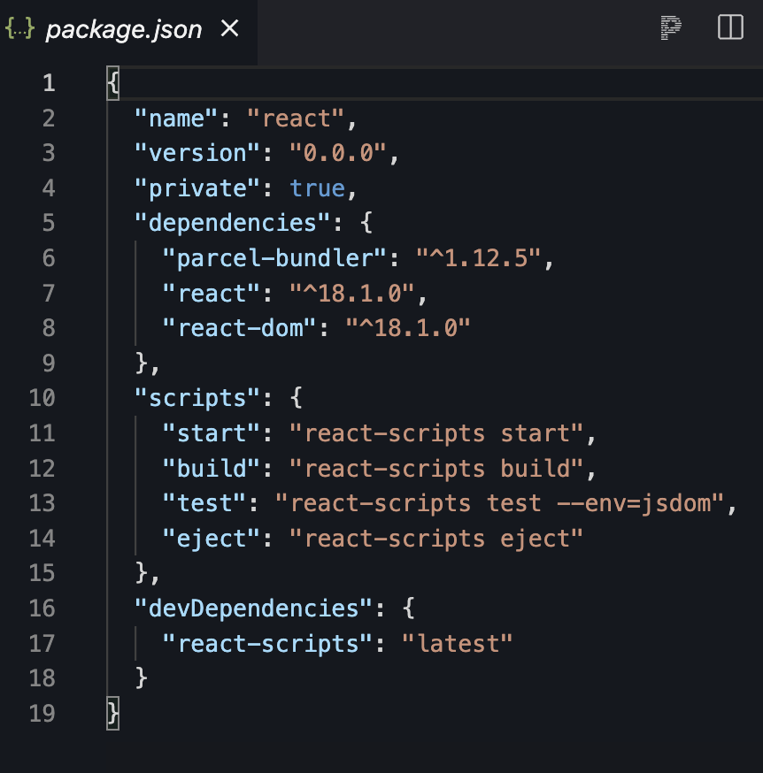
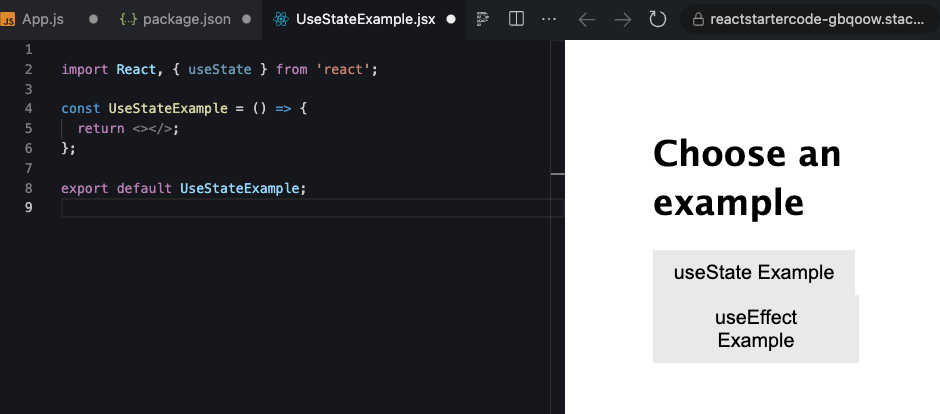

## L02 Hands On Project: Common Hooks

Welcome to the Common Hooks hands-on practice assignment.

Arguably the most common Hooks you’ll encounter are:

- `useState` - used to interact with a component’s `state`.

- and `useEffect` -  best thought of as replacing the React lifecycle events such as `componentDidMount` and `componentDidUpdate`.

Before you move on to your big project in this lesson, take some time to familiarize yourself with the use of these two most common built-in Hooks.

## Requirements

1. Read all the guided learning text carefully for understanding.
2. Follow all instructions and coding step-by-step.
3. Create all files and folders for the Greeting App.
4. Complete all coding as demonstrated in all files.
5. Download Project Files
6. Add Replit URL to text document.
7. Zip text document and Project Files together.
5. Zip `L02ReactHandsOnPProject1` Folder
6. Attach the zipped folder below where indicated for submission.


## Get Starter Code Replit

- Fork the repository
- Name it l02handsonpplication
- Open your newly forked repository to start working on it.

**Note** You don’t need to do any configuration to make it work, because you’re using `Parcel`.

### Check `package.json` for React Dependencies

- There are two packages you need; `React`, and `React DOM`. 	
	-  `React` is the star of the show and includes the core `React` library. 
	-  `React DOM` is a secondary package responsible for rendering  `components` to the `DOM` in the browser.

- You should see the `react` and `react-dom` dependencies in your `package.json` as below.



After your app is ready, call `Parcel` to bundle everything, and run it. It’s not a huge job, but you can add a simple shortcut to help out.

In your `package.json` file, add a new property, ‘`scripts`’ and add a new command property under this and call it ‘`start`’. Next, add the command:

`Parcel` works by giving the app an entry point, in this case, your `index.html` file which you build next. From there, `Parcel` determines which files it needs to include in the bundle based on your imports and file references.

## Code the Project Files

On to the exciting part: build out your app! For smaller projects like this, just start by creating all the files you need, and then filling them in as you go along.

After you review your files and folder structure, we will start coding them. Start with your `index.js` file.

**index.js**

```
import React from 'react';
import ReactDOM from 'react-dom/client';
import { createRoot } from 'react-dom/client';

import App from './App';
​
const rootElement = document.getElementById('root');
const root = createRoot(rootElement);

root.render(
  <>
    <App />
  </>
);

```

### App.js

In your `App` component, the main starting point for your React app, use a Hook, the `useState` Hook.

**App.js**

```
import React, { useState } from 'react';

import './style.css';

// components
import UseStateExample from './UseStateExample';
import UseEffectExample from './UseEffectExample';

export default props => {
  const [example, setExample] = useState('UseStateExample');

  return (
    <>
      <h1>Choose an example</h1>
      <button onClick={() => setExample('UseStateExample')}>
        useState Example
      </button>
      <button onClick={() => setExample('UseEffectExample')}>
        useEffect Example
      </button>
      <div className='container'>
        {example === 'UseStateExample' ? (
          <UseStateExample />
        ) : (
          <UseEffectExample />
        )}
      </div>
    </>
  );
};
```

You imported your two example components, `UseStateExample` and `UseEffectExample` and use the example value in `state` to determine which one to show.

If example is set to the string ‘`UseStateExample`' then you show the `UseStateExample.jsx `component, otherwise, show the `UseEffectExample.jsx` component.

You also have two buttons that both call the `setExample()` method to update the example `state` value, which will, in turn, change which child component is displayed.

### style.css

Many of the styles here are the same basic styles from your first example built in Lesson 1, the Greeting App. You add a couple extra layout selectors at the bottom to add some flex box support and additional styling to some form elements, such as a `select` and `label`.

**style.css**

```
body {
  font-size: 16px;
  line-height: 1.4;
  font-family: 'Lucida Sans', 'Lucida Sans Regular', 'Lucida Grande',
    'Lucida Sans Unicode', Geneva, Verdana, sans-serif;
  margin: 5em;
}

p {
  margin-bottom: 1.6em;
}

input,
select {
  padding: 0.5em 1em;
  line-height: 1;
  font-size: 18px;
  border: 1px solid #ececec;
}

button {
  border: 1px solid #ececec;
  background: #ececec;
  padding: 0.5em 1em;
  cursor: pointer;
  font-size: 18px;
  margin-right: 15px;
}

button:hover {
  background: #c9c6c6;
}

label {
  display: block;
  margin-bottom: 0.5em;
}

label + input,
label + select {
  margin-bottom: 1em;
}

form button {
  display: block;
}

.container,
.dogs-container {
  padding: 0 2em 2em;
  border: 1px solid #ececec;
  border-radius: 4px;
  margin: 1em auto;
}

.form-message {
  background-color: #ececec;
  border-radius: 4px;
  margin: 1em auto;
  padding: 2em;
  font-size: 18px;
}

.dogs-container {
  display: flex;
  align-items: center;
  justify-content: space-around;
}

.dogs-container img {
  max-width: 250px;
  max-height: 200px;
}
```

You see some simple styles that just affect the `body`, `font size`, and `line-height`. Later, you add an `input` and a `button` to your app, so you also added some nice styles for those.

'Save' file.

### index.html

Add `HTML` to your `index.html` file. 

Your `index.html` file simply provides a basic entry point for Parcel to follow and find your JavaScript starting point.

It looks like this:

**index.html**

```
<!DOCTYPE html>
<html>
  <head>
    <title>Hooks example demo</title>
  </head>
  <body>
    <div id="root"></div>
  </body>
</html>
```

### Create Files

Your project is set up and ready to run. Add necessary files to your project before you code them out.

- `UseEffectExample.jsx`
- `UseStateExample.jsx`

`UseStateExample.jsx` and `UseEffectExample.jsx` are where you do the main body of your work, so get your other files set up before you explore your example components.

With the basic files set up and ready, take a closer look at the `useState` and `useEffect` Hooks.

## The useState Hook (Explanation Only)

`useState` is a direct replacement for the class-based `state` you see used in this manner:

```
// updating state
this.setState({
  someProperty: 'some value'
});

// using state
<p>The value is {this.state.someProperty}</p>;
```

As you already saw in the previous lesson, the `useState` Hook has a very simple syntax for setting and retrieving values from.

```
// initial declaration
const [nameOfValue, setNameOfValue] = useState('initial value here');

// updating state
setNameOfValue('a new value');

// using state
<p>The value in state is {nameOfValue}</p>;
```

You’re not limited to what you can store inside this `state` Hook, just like you’re not limited with `state` used in a class component. Any valid JavaScript primitive value, array, object, and even function can be passed into and stored in `state`.

The convention is to have distinct declarations for multiple values, unless they’re logically able to be kept together, such as with form values.

```
// multiple values
const [itemCount, setItemCount] = useState(0);
const [data, setData] = useState([]);
const [balance, setBalance] = useState(null);

// grouped values
const [formValues, setFormValues] = useState({
  name: '',
  email: '',
  message: ''
});
```

In the first group, you see singular values such as an integer, '0', an empty array, and a `null` value. These are all distinct pieces of `state` and declared in their own variable pairs, each using a separate call to `useState`. However, for the `formValues` variable, you're calling `useState` and passing in an object with multiple properties, one for `name`, `email`, and `message`, that each represents a form field value.

You could have separate these values out into their own `useState` call like this:

```
const [name, setName] = useState('');
const [email, setEmail] = useState('');
const [message, setMessage] = useState('');
```

This is fine and you see this approach quite frequently. As with many things in development, there are personal preferences and trade-offs on how you tackle a problem and implement a solution. For me, it makes sense to group closely related slices of data, such a collection of form field values, into a single place (i.e. the `formValues` variable above), but it does add a little more overhead in dealing with updates to any particular form field's value. Conversely, if you have a really large form with many field values, breaking each one into a separate call to `useState` could potentially create much more code for you to manage and a very large component.

With the explanation out of the way, build a little example app to demonstrate how to use `useState` and the values it can be used with.

### You Try Now

First: open the `UseStateExample.jsx` file, where you’ll import React and create the empty component’s skeleton:

**UseStateExample.jsx**

```
import React, { useState } from 'react';

const UseStateExample = () => {
  return <></>;
};

export default UseStateExample;
```



Look at how to effectively use the `useState` Hook. You’re going to build an `HTML` form that will update values in your component’s `state`, and display a message to your user once they’ve submitted the form.

To do that, you need a few things:

- An object in `state` to track `state` values

- A value in `state` to determine if you should show the message (i.e. has the form been submitted?)

- Methods to handle changes in the form elements and form submission

- An HTML form

Your component’s looking a little bare at the moment, so let’s code it out.

### Add in State

The first thing is add your `state` values and items, **right at the top** of the component.

**UseStateExample.jsx**

```
import React, { useState } from 'react';

const UseStateExample = () => {
  const [showMessage, setShowMessage] = useState(false);
  const [formValues, setFormValues] = useState({
    name: '',
    age: '',
    fruit: ''
  });
  return <></>;
};

export default UseStateExample;
```
You really can store just about anything you want in `state`. Your first `state` variable, `showMessage` is going to hold a boolean value, while `formValues` holds an object with some default key-value pairs where you track the input from your user.


#### Tip!

You don’t have to add the keys in like done here, but it’s good practice. It let's you get an idea of what data your form will capture and what the expected type of that data will be, without having to run anything.

### Event Handling Methods

 Map out your `state` updating methods and event handlers: one for a change of any form field values, and one to handle the form submission.


**UseStateExample.jsx**

```
import React, { useState } from 'react';


const UseStateExample = () => {
  const [showMessage, setShowMessage] = useState(false);
  const [formValues, setFormValues] = useState({
    name: '',
    age: '',
    fruit: ''
  });

  const handleChange = evt => {
    const updatedFormValues = {
      ...formValues,
      [evt.target.id]: evt.target.value
    };

    setFormValues(updatedFormValues);
  };

  const handleSubmit = evt => {
    evt.preventDefault();
    setShowMessage(true);
  };
  
  return <></>;
};

export default UseStateExample;
```

### UseStateExample.jsx

  In the `handleChange` event, you’re still using the `evt.target.value` to retrieve the current value from the underlying `HTML` element (e.g. a text input field), but you’re creating a new `updatedFormValues` object first. You're using the spread syntax (the three dots you can see before `formValues`) which will essentially copy everything from the current `formValues` object in `state` into your `updatedFormValues` object.

Immediately after this, we used the bracketed notation `[evt.target.id`] to reference a property dynamically on the `updatedFormValues` object, specifically referencing using the form field's `id`. If it exists on the object then the value we assign to it (e.g. `evt.target.value`) will be updated. If it doesn't exist, then a new property will be created and assigned the value of `evt.target.value`.	

Finally, we updated our form field values object in `state` by calling `setFormValues()`.

Another thing to point out is your use of `evt.preventDefault()` in the `handleSubmit` method. The event React passes us is synthetic, the form submission caused by the button you add at the moment is very real. By calling the `preventDefault()` method when the form submits, you stop the form from triggering a complete page reload. If that happens, you lose your `state` values and your app will produce unintended results.

Other than that, the `handleSubmit` method is simple. You change the value of `showMessage` in `state` to ‘`true`’ which will be used later in your returned JSX.

### HTML (JSX)

The final piece of the puzzle is to add `JSX` in the return method so you can render something useful to the user.

First, a little message introducing the app to the user:

**UseStateExample.jsx**

```
 return 
  <>
  <p>Complete the form below and see a nice message about yourself!</p>
  </>;
};

export default UseStateExample;
```

Next, add `HTML` form:

**UseStateExample.jsx**

```
     
import React, { useState } from 'react';


const UseStateExample = () => {
  const [showMessage, setShowMessage] = useState(false);
  const [formValues, setFormValues] = useState({
    name: '',
    age: '',
    fruit: ''
  });

  const handleChange = evt => {
    const updatedFormValues = {
      ...formValues,
      [evt.target.id]: evt.target.value
    };

    setFormValues(updatedFormValues);
  };

  const handleSubmit = evt => {
    evt.preventDefault();
    setShowMessage(true);
  };

  return 
  <>
  <p>Complete the form below and see a nice message about yourself!</p>
  </>;

<form onSubmit={handleSubmit}>
<label htmlFor='name'>What should we call you?</label>
<input id='name' value={formValues['name']} onChange={handleChange} />

<label htmlFor='age'>How old are you?</label>
<input id='age' value={formValues['age']} onChange={handleChange} />

<label htmlFor='fruit'>What's your favorite fruit?</label>
<select id='fruit' value={formValues['fruit']} onChange={handleChange}>
  <option>Bananas</option>
  <option>Apples</option>
  <option>Oranges</option>
  <option>Strawberries</option>
  <option>Pears</option>
  <option>Dragon fruit</option>
</select>

<button>Submit</button>
</form>
};

export default UseStateExample;
```

There are a couple of things to highlight:

- Notice on your labels you use `htmlFor=` instead of the HTML `for=`. This is because you’re still in JavaScript land and `for` is a protected keyword. You can use it, but React will complain, giving warnings in the browser and any tools like ESLint will also notify you of this. Stick to `htmlFor=` when using this attribute on labels in React.
- Each of your HTML elements (inputs and select) are setting the `value=` attribute using a named key from your `formValues` state object. They also each reference the same change event handler, `handleChange` you defined previously.
- Finally, there’s no event handler attached to the button within your form. This is because this button will trigger a form submission event by default when it’s clicked. So all you need to do is attach your `handleSubmit` event handler to the form itself.

Once you collect your user data and submit it, you need to display a message.


**UseStateExample.jsx**

```
      button>Submit</button>
</form>


{showMessage && (
  <div className='form-message'>
    <p>
      Hi <strong>{formValues['name']}</strong>, what a lovely name. And I
      can't believe you're only <strong>{formValues['age']}</strong> years
      old, that's no age!
    </p>
    <p>
      Your favorite fruit can't be <strong>{formValues['fruit']}</strong>
      , mine too!
    </p>
  </div>
)}
}
export default UseStateExample;

```

You have a couple of simple paragraphs where you reference the values from `state`. You also wrap this entire block in a simplified logic expression:

**UseStateExample.jsx**

```
{ showMessage && (...rest of expression)}
```

JavaScript evaluates the left side of the expression, `showMessage` and if that’s ‘`false`’, doesn’t look at the right side of the expression. However, once `showMessage` is ‘`true`’ it will evaluate the right-hand side, which will essentially render your JSX block.


### The Complete UseStateExample.jsx file

The finished file looks like this:

**UseStateExample.jsx**

```
import React, { useState } from 'react';

const UseStateExample = () => {
  const [showMessage, setShowMessage] = useState(false);
  const [formValues, setFormValues] = useState({
    name: '',
    age: '',
    fruit: ''
  });

  const handleChange = evt => {
    const updatedFormValues = {
      ...formValues,
      [evt.target.id]: evt.target.value
    };

    setFormValues(updatedFormValues);
  };

  const handleSubmit = evt => {
    evt.preventDefault();
    setShowMessage(true);
  };

  return (
    <>
      <p>Complete the form below and see a nice message about yourself!</p>
      <form onSubmit={handleSubmit}>
        <label htmlFor='name'>What should we call you?</label>
        <input id='name' value={formValues['name']} onChange={handleChange} />

        <label htmlFor='age'>How old are you?</label>
        <input id='age' value={formValues['age']} onChange={handleChange} />

        <label htmlFor='fruit'>What's your favorite fruit?</label>
        <select id='fruit' value={formValues['fruit']} onChange={handleChange}>
          <option>Bananas</option>
          <option>Apples</option>
          <option>Oranges</option>
          <option>Strawberries</option>
          <option>Pears</option>
          <option>Dragon fruit</option>
        </select>

        <button>Submit</button>
      </form>
      {showMessage && (
        <div className='form-message'>
          <p>
            Hi <strong>{formValues['name']}</strong>, what a lovely name. And I
            can't believe you're only <strong>{formValues['age']}</strong> years
            old, that's no age!
          </p>
          <p>
            Your favorite fruit can't be <strong>{formValues['fruit']}</strong>
            , mine too!
          </p>
        </div>
      )}
    </>
  );
};

export default UseStateExample;
```

### index.js

```
import React from 'react';
import ReactDOM from 'react-dom/client';
import { createRoot } from 'react-dom/client;
​
import App from './App';
```

## The useEffect Hook

The `useEffect` Hook is a bit more complex to understand than its `useState` cousin.

React has several lifecycle methods triggered during specific parts of a component's journey from being mounted, to when it updates, and finally, when it unmounts.

`useEffect` gives you a combined method that runs on each render of a component. It can be used multiple times to separate any distinct logic, and it can also be passed an array of dependencies React will monitor for changes. Should any of those dependencies change, only then would that particular `useEffect` call be executed.

Additionally, some work requires a clean up phase (e.g. subscriptions to external data sources). For these tasks, return a function as part of your `useEffect` call to carry out any clean up code you need. Think of this as replacing the `componentWillUnmount` lifecycle event.

Look at the syntax closer to get an idea of how it works:

**MyComponent.jsx (Explanatory Only - Don't Code)**

```
const MyComponent = props => {
  // a simple useEffect declaration
  useEffect(() => {
    // log some data on each render
    cleverDataLoggingService.log('ooo what an exciting log entry');
  });

  // cleaning up on unmount
  useEffect(() => {
    // on mount and rerender
    // subscribe to an external API
    productAPI.subcribeToProductList(props.customer.id);

    return () => {
      // on render and unmount
      productAPI.unsubscribeFromProductList(props.customer.id);
    };
  });

  // using dependencies
  useEffect(() => {
    // this will only run when 'props.customer.id' changes
    console.log(`logged in customer is: ${props.customer.id}`);
  }, [props.customer.id]);
};
```

The Dog CEO API address will return a single image of a dog (that’s no good!), so append a random number onto this later on so we get a nice amount of dog images back.

With state variables, `dogImageUrls` is set to an empty array to begin with, but it will hold a list of picture URLs once the API has been called. With `loadPictures`, set it to ‘`false`’ for now, but you can use this to toggle whether the app is in the middle of loading data or not.

## Create the Image Fetching Function

Call the API to get the pictures in the first place. You define that next:

**UseEffectExample.jsx**

```
import React, { useState, useEffect } from 'react';

const UseEffectExample = () => {
  const apiBaseUrl = 'https://dog.ceo/api/breeds/image/random/';
  const [dogImageUrls, setDogImageUrls] = useState([]);
  const [loadPictures, setLoadPictures] = useState(false);
  const loadDogPictures = () => {
    const numToLoad = Math.random() * 10;
    fetch(`${apiBaseUrl}${numToLoad}`)
      .then(response => response.json())
      .then(data => setDogImageUrls(data.message));
  };
  return <></>;
};

export default UseEffectExample;
```

### Create the useEffect Calls

 Use the `useEffect` Hook in two separate calls here: one that will be used on the initial mount of the component, and the other will trigger a new load of pictures when the state value `loadPictures` changes.

**UseEffectExample.jsx**

 ```
import React, { useState, useEffect } from 'react';

const UseEffectExample = () => {
  const apiBaseUrl = 'https://dog.ceo/api/breeds/image/random/';
  const [dogImageUrls, setDogImageUrls] = useState([]);
  const [loadPictures, setLoadPictures] = useState(false);
  const loadDogPictures = () => {
    const numToLoad = Math.random() * 10;
    fetch(`${apiBaseUrl}${numToLoad}`)
      .then(response => response.json())
      .then(data => setDogImageUrls(data.message));
      useEffect(() => {
        loadDogPictures();
      }, []);
  };
  return <></>;
};

export default UseEffectExample;
```

By passing to this effect an empty dependency array, you effectively tell React to execute the effect, but only once, on the first mount.

You do that, because you want to have some dog pictures available when the component first mounts, but not every time anything happens, such as the component updates.

You do, however, want to trigger a new fetch when the user clicks the ‘load more pictures!’ button. When they do that, the value in state for loadPictures will change. You can have React watch this value and execute our second effect only when it changes.

**UseEffectExample.jsx**

```
import React, { useState, useEffect } from 'react';

const UseEffectExample = () => {
  const apiBaseUrl = 'https://dog.ceo/api/breeds/image/random/';
  const [dogImageUrls, setDogImageUrls] = useState([]);
  const [loadPictures, setLoadPictures] = useState(false);
  const loadDogPictures = () => {
    const numToLoad = Math.random() * 10;
    fetch(`${apiBaseUrl}${numToLoad}`)
      .then(response => response.json())
      .then(data => setDogImageUrls(data.message));
      useEffect(() => {
        if (loadPictures) {
          loadDogPictures();
          setLoadPictures(false);
        }
      }, [loadPictures]);
  };
  return <></>;
};

export default UseEffectExample;
```

You supply `loadPictures` as a dependency on the `useEffect` Hook. When it changes, React will execute whatever you supply to the function. In this case, check to make sure it’s set to ‘`true`’, calling the API again before setting the value back to ‘`false``’, which will enable the button to work again.

You may be asking ‘won’t this just trigger this effect to be called again, even when `loadPictures` is set back to ‘`false`’?!’. The answer is ‘yes’, but by checking if it’s set to ‘`true`’ at the start of the function, you avoid some horrible infinite loop scenario.

### Add the Button and Gallery JSX

With all your logic in place, process the images and display an attractive gallery of sweet dogs to your users.

**UseEffectExample.jsx**

```
 
return 
  <>
     <h2>Random dog pictures</h2>
      <button onClick={() => setLoadPictures(true)}>
        Load some more pictures!
      </button>
      <p>
        {dogImageUrls.length <= 0
          ? '...loading'
          : `We've got ${dogImageUrls.length} pictures for you:`}
      </p>
      <div className='dogs-container'>
        {dogImageUrls.map(imgUrl => (
          
        ))}
      </div>
    </>

  }


export default UseEffectExample;
```

Starting with a title, add a button that simply sets the `state` to ‘`true`’. As you discovered when you mapped out the `useEffect` calls, because React is watching this value as a dependency, it will automatically trigger a fetch of some new dog pictures.

Under this, display a message to the user based on the value of `loadPictures`: ‘…loading’ if set to ’`true`’; or the number dog pictures the user can be expected to see if ‘`false`’.

Now the part you have been waiting for; the pictures themselves!

Use the `.map()` function built into JavaScript,  for arrays to step through your array of dog pictures outputting an image tag.

#### Note!

You added an extra attribute you might not be familiar with right away. The `key=` attribute is another React-specific attribute needed when rendering lists of things. It helps React keep track of changes within the list, such as if any have been added, removed, etc. Supply a unique identifier to each item in a list to give the elements a stable identity.

The nice thing about the `.map()` function is if we have an empty array (like when we initialize it to `[]` at the beginning of the component), nothing is output to the user.

The last thing to do is enjoy some wholesome dog pictures: what the Internet was made for.


### The Complete UseEffectExample.jsx Component

Here's what the complete file will look like:

**UseEffectExample.jsx**

```
import React, { useState, useEffect } from 'react';

const UseEffectExample = () => {
  const apiBaseUrl = 'https://dog.ceo/api/breeds/image/random/';
  const [dogImageUrls, setDogImageUrls] = useState([]);
  const [loadPictures, setLoadPictures] = useState(false);

  const loadDogPictures = () => {
    const numToLoad = Math.random() * 10;
    fetch(`${apiBaseUrl}${numToLoad}`)
      .then(response => response.json())
      .then(data => setDogImageUrls(data.message));
  };

  useEffect(() => {
    if (loadPictures) {
      loadDogPictures();
      setLoadPictures(false);
    }
  }, [loadPictures]);

  useEffect(() => {
    loadDogPictures();
  }, []);

  return (
    <>
      <h2>Random dog pictures</h2>
      <button onClick={() => setLoadPictures(true)}>
        Load some more pictures!
      </button>
      <p>
        {dogImageUrls.length <= 0
          ? '...loading'
          : `We've got ${dogImageUrls.length} pictures for you:`}
      </p>
      <div className='dogs-container'>
        {dogImageUrls.map(imgUrl => (
          
        ))}
      </div>
    </>
  );
};

export default UseEffectExample;
```
---

## Submit

Include the submit zip folder box here, with link to open code solution after submission.


---


<div class="panel panel-danger">
    <div class="panel-heading">
        <h3 class="panel-title">Caution!</h3>
    </div>
    <div class="panel-body">
        <p>Be sure to zip up all of your documents to submit them</p>
    </div>
</div>

