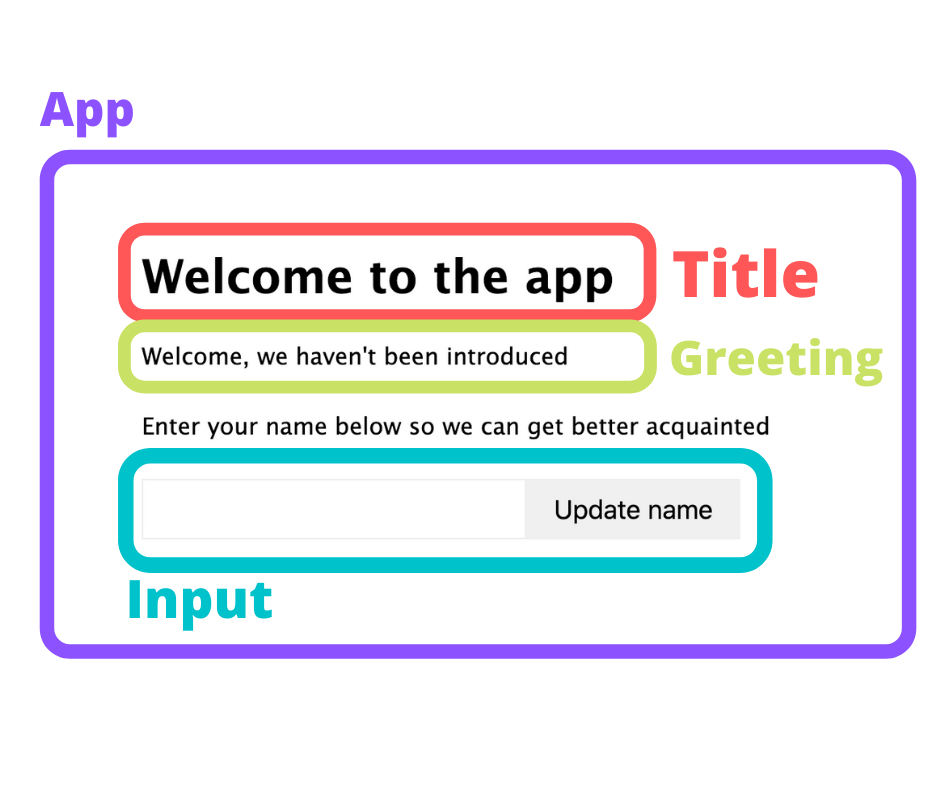
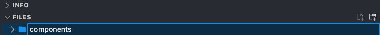
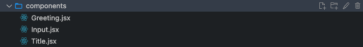

## L01 Hands On Guided Learning #2: Build the Greeting App

Welcome to your second React hands-on practice assignment, as part of this React Course.

You will build on the Greeting App you completed previously. 

## Requirements

1. Fork you completed project `L01ReactHandsOnPractice` in StackBlitz. 
2. Name as `L01ReactHandsOnProactice2` inside your `FEFReact folder.
3. Open `L01ReactHandsOnProactice2` 
4. Read all the guided learning text carefully for understanding.
5. Follow all instructions and coding step-by-step.
6. Create all files and folders for the Greeting App.
7. Complete all coding as demonstrated in all files.
8. Download Project Folder.
9. Add URL to Project on a text document.
10. Zip `L01ReactHandsOnPractice2` and text document Folder
9. Attach the zipped folder below where indicated for submission.


## Refactor the Greeting App

With your Greeting App, you will learn to 'think in React' by breaking down your small `App` into components and refactoring it to use them.

You built your first app and it’s looking and working great. Currently, it’s using the class-based component approach, but you will refactor it to achieve a few things:

- Think about your apps in a **component**, modular fashion.

- Try your hand at breaking down a larger component into smaller ones.

- Introduce the common functional component approach to building your React components.

At the moment, you have one large class-based component with all the different things going on, including your event handlers for on change and on click. You have a dynamic greeting and a title in there too.

It's not a very large component, but you can see how easily it could get out of hand as you add more and more features and functionality to it. It’s not very modular and it’s certainly not very reusable.

It's good practice to analyze your `components` and try to break them down into smaller ones where possible and where it makes sense. This way, you will encapsulate functionality into smaller working parts that can be duplicated and used in different places throughout your app.

### Thinking in Components

It’s useful to look at a larger component as a whole, and then think about the smaller, independent parts of functionality it contains. These smaller moving parts can be broken down into other components and used elsewhere; they’ll no longer be tied to this single, larger containing component.

To do that with your `App` component, look at what it’s currently doing and see there are three distinct functions it performs that would be good candidates for separate `components`:

1. **Displays a welcome message in a heading level one tag**:

	- This could have different styling applied in different parts of the app, or accept different messages on different pages, so it’s a good fit to be separated.

2. **Displays a dynamic message to the user including data from state**:

	- This greeting is simple and generic. You may see it on the home page, or in the main navigation, of an e-commerce site to greet whoever’s logged in.

3. **Accepts input from the user and triggers an event on click of a button**:

	- You’re using the input and button combination to accept a name, but it might also work on a contact form, or as part of a search form. Being able to have these two connected elements in one place, in a separate component makes it a great candidate for refactoring now.

Here’s a diagram of how you can group these separate areas of functionality into independent components: `Title`, `Greeting`, and `Input`. These child `components` will be imported into their parent, the `App` component.



### Plan the Refactor

You have an idea of the `components` you need to build, and now you just need a set of steps to carry out your refactoring work.

Those steps might look like this:

1. Create a `components` folder to hold your new `components`.

2. Create three new `components`;

	- `Title`
	- `Greeting`
	- `Input`

3. Refactor the `App` component to use your new `component`s.

4. Refactor the `App` component from class-based to a functional component.

## Refactor Setup

Now you have a plan. Do some setup work before you start. Like you did in the last section, create all the files you need first, and fill them in with code as you go along, building out the components and refactoring them as you go.

1. First, add a new folder, and call it `components`. 



2. Within your `/components` folder, create three empty `component` files with the `.jsx` file extension (remembering to capitalize the first character in the file name):




- **Title.jsx**
	
- **Greeting.jsx**
	
- **Input.jsx**
	

Files with the `.jsx` extension are specific to the React library, and will typically contain the familiar HTML-like syntax you’ve seen in earlier sections. It’s important to note this file extension is down to personal preference. JSX files will be converted into raw JavaScript by a tool such as Babel JS before being run in the browser. Some people prefer to have presentational components that just accept static data and display it, using the `.jsx` file extension to denote them. The important thing to remember is you can use either `.js` or `.jsx` to name your files. There is no difference, only personal preference.

Start moving through the files and coding them.

### Title.jsx

Start by repeating:

1. ‘React must be in scope in order to use it!’

2. Import React first before you do anything else.

Instead of the class-based approach previously used for your `App` component, the `Title` component will be your very first functional one. Define a functional component as just that, a function.

However, rather than define a function and then set it as the default export, do so in one line:


**Title.jsx**

```
export default props => <h1>Welcome to the app</h1>;
```

**Note**

This is a nice style to have for smaller, less complex components, especially if they’re purely presentational, like here. However, if your components start to grow, or feature complex functionality that may cause bugs, it makes sense to define your function and assign it to a variable (i.e. a `const`) and then export it immediately afterward. This is because the React debugging tools struggle to identify components defined and exported in a single line as we are doing here.

You have a default export which is a function that accepts a props object and uses an implicit return (that is without the return keyword and some JSX within parentheses). Because you’re not doing any other logic, manipulating `state`, etc. you’re just returning some JSX, you use this implicit return to make things look a little neater and remove unnecessary lines of code.

That’s it…sort of. You have a `<h1>` being returned, but you have a fixed string, ‘Welcome to Software Development’. That’s fine for your Greeting App, but not very reusable if you want to have this component on another page that says something different.

Make this title dynamic. Instead of it being hardcoded to a string, use your curly brace syntax again and use a value you can pass in via your `props` object.


**Title.jsx**

First, import React at the top.

```
import React from 'react';
```

then export with propos object.

```
export default props => <h1>{props.title}</h1>;
```

However, take this another step further. Because you know you’re only passing in a `title` value via props, reference this value directly using object destructuring.


**Title.jsx**

```
export default ({ title }) => <h1>{title}</h1>;
```

Props will expect and be passed a property called `title`, so by replacing props with some curly braces, now start to directly name properties you expect props to have. This is JavaScript’s destructuring syntax and it’s really helpful!

As well as replacing the props argument in your function, replace the `{props.title}` with just `{title`,} too.

You’re left with a really simple, small, reusable `component`. It can be used wherever you need across your `app` in different areas. It’s also useful if you need to make changes to the way titles look, such as styling, size, color, tag attributes; all those changes can be made in this one, single place.

**Note**

What you're making right now is a very contrived example to get a feel for React, but it's good to start thinking in terms of how you can use this in real world applications as you start learning and growing and building things for yourself.

This is something you do further on in the course as your apps start to grow and get bigger. But for now, this is your `title` component ready to go.

#### Completed Title Component

Here’s your finished Title component:

**Title.jsx**

```
import React from 'react';

export default ({ title }) => <h1>{title}</h1>;

### Greeting.jsx

Tackle the greeting message from your `App` component:


**Greeting.jsx**

```
 		 <p>
          Hi there, {this.state.displayName || "we haven't been introduced"}
        </p>
```

You have a paragraph tag with a string and a ‘`displayName`’ value you get from `state`. Pull this out into your `Greeting` component.

Start by importing React:


**Greeting.jsx**

`import React from 'react';`

Like your `Title` component, do an inline default `export` next below the import statement, along with an implicit `return`, because all you're doing is returning one line which is going to be your greeting with a dynamic name value.


**Greeting.jsx**

```
export default ({ name = "we haven't been introduced" }) => (
  <p>Hi there, {name}</p>
);
```

You also repeat the destructuring syntax here to pull out the name value from props. The difference this time is you add a default value for the name variable, just in case it’s not set.

You could do the same as you had in your `App`, `{name || “we haven’t been introduced”`} using the logical `OR` operator, but this way is a little neater. 

You `Greeting` component is built.

#### Complete Greeting Component

Here's your complete Greeting component:

**Greeting.jsx**

```
import React from 'react';

export default ({ name = "we haven't been introduced" }) => (
  <p>Hi there, {name}</p>
);
```
### Input.jsx

The next thing to build is your combined `input` and `button` component. This one's going to be slightly larger, but still not very complex.

Import React into your component. This time you’re also going to add an extra named import `useState`.


**Input.jsx**

`import React, { useState } from 'react';`

Because your input element relies on your `App` component’s `state` to manage its value, you use `state` in your new `Input` component. However, the `Input` component is a stateless, functional component, not a class-based one. To use `state` in a functional component, you use a feature of React called `Hooks`. In your case, to access `state` from a functional component, use the `useState` Hook.

**Tip!**

Hooks were introduced as part of React v16.8. They allow access to `state` and other React features without writing a class. You cover Hooks in greater detail in the next lesson, including `useState`. For now, focus on getting the components built as you code along and become familiar with the `useStat`e syntax for accessing `state` in a functional component.

You imported React, now define your `Input` component and export it. Be sure to copy in the `input` and `button` elements from your `App` component.

**Input.jsx<**

```
import React, { useState } from 'react';

const Input = props => {
  return (
    <>
      <input value={this.state.name} onChange={this.handleChange} />
      <button onClick={this.handleClick}>Update name</button>
    </>
  );
};

export default Input;
```


Notice how you capitalized your `const` variable `Input`. This is the naming convention, not a rule. Since you create a `component`, it’s best practice to capitalize `component`s’ names.

### Update the Input Element

You can't have the `input` and the `button` side by side like this, because it'll throw an error. To avoid this, you will wrap them in a React fragment.

The previous two components, `Greeting` and `Title`, both used an implicit return because they didn’t have any logic to deal with. They just returned their JSX elements. Your `Input` component needs to do a little more, specifically set values with the `useState` Hook.

Because of this, you explicitly define a return statement that contains your desired JSX output (i.e. the `input` and `button` elements). This is different from the `App` component, which has to define a `render()` method, which then returns some JSX. You also see that because the `Input` component is a function, you don’t need to define a constructor, or call a parent class’ `super()` method.

Your app is looking sharp so far, but you need to make a couple of edits for it to work.


**Input.jsx**

```
<input value={this.state.name} onChange={this.handleChange} />
```

Looking at the input element in your return statement, you still reference a `state` value and a `handleChange` event from your `App` component. Neither of these two things works because of the differences between your `App` component, which is class-based, and your `Input` component, which is functional.

Luckily, you can replace both these things with the `useState` Hook! First, define the Hook at the top of your component and then start using it with the input element.


**Input.jx**

```
import React, { useState } from 'react';

const Input = props => {
	const [name, setName] = useState('');
  return (
    <>
      <input value={this.state.name} onChange={this.handleChange} />
      <button onClick={this.handleClick}>Update name</button>
    </>
  );
};

export default Input;
```

It may look a little strange if you’re not familiar with this sort of syntax, but the `useState` Hook works like this:

`useState` is a method React provides as part of its core library.

You call it, passing in whatever default value you want this particular item in `state` to represent. For example; you’re calling it using `useState(‘’)` which will set the value in `state` as an empty string.

The method returns an array with two items. The first item represents the value held in `state`, and the second item is a method that can be used to update the first item in `state`.

Use the array destructuring syntax in JavaScript to access both of these items.

In your component, you define a `const` which is a destructured array. This array contains two items: the first is the value held in `state`, call it `name`, but remember this is a title you’re giving it. You could call it anything, but call it `name` as that’s meaningful right now.

The second item will be the method `useState` provides to update the first value, the value held in `state`. Again, you can call it whatever you like, but the sensible convention is to call it the same as the name of the `state` value, prefixed the word ‘`set`’. Call it `setName`.

Now, whenever you want to update the value of `name` in `state`, call the `setName()` method, passing in a new value.

Looking back at your `input` element, you’re ready to update its attributes to use your new `state` Hook variables, `name` and `setName()`.


**Input.jsx**

```
      <input value={name} onChange={evt => setName(evt.target.value)} />
```

The first edit is to change the location of your `state` data for the `value={}` attribute on your input element. Change `value={this.state.name}` to remove the reference to `this.state` that only applies to a class. The value is now going to be stored in your name variable returned from the `useState` Hook.

Updating this reference gives  `value={name}`.

The next thing was replace the call to the missing `this.handleChange` method referenced in the `onChange={}` attribute.


**Input.jsx**


Since you use the `setName()` method you got from your `useState` Hook, you can actually simplify how you call this and do it inline, in the `onChange` attribute. Using a single line arrow function you just call `setName()` directly and use the same `evt.target.value` to reference the underlying value of the input element from the event (the evt argument) that you’re passed in by the `onChange` event.

Don't be be tempted to just call `setName()` directly without an arrow function like this, `onChange = { setName(evt.target.value) }`. Events like the `onChange` event, require you to pass a function that can be called when the time comes. By writing out the function directly and passing it arguments, you effectively invoke that function right away. This creates a problem, especially when you update `state` values, which causes React to render the component again, which, in turn, calls the function again, resulting in an infinite loop.

Next, update your `button` element.

### Update the Button Element

The `button` element presents an interesting situation. You need to trigger an update to `state` for the `displayName` property. However, that particular piece of `state` lives in the `App` component.

How can you update `state` data in another component?

Do it the same way you can pass data down to child components via the props object.  Send data back up using events and event handlers (see the next lesson for more information on this).

To do this, update your `button` element with a similar-looking anonymous arrow function you used for the `input` element.


**Input.jsx**

```
      <button onClick={() => props.handleClick(name)}>Update name</button>
```

This time, instead of calling a function on the `App` component’s class as you did previously (using `this.handleClick`), call the same function but from your props object. Pass in the up-to-date value for `name` from the local `state` data. 

#### Complete Input Component

Here's the complete `Input` component:


**Input.jsx**

```
import React, { useState } from 'react';

const Input = props => {
  const [name, setName] = useState('');

  return (
    <>
      <input value={name} onChange={evt => setName(evt.target.value)} />
      <button onClick={() => props.handleClick(name)}>Update name</button>
    </>
  );
};

export default Input;
```

## Update the App Component

With your three new components complete, it’s time to edit the `App` component to use them.

Import your new components under existing import statements.

**App.jsx**

```
import Title from './components/Title';
import Greeting from './components/Greeting';
import Input from './components/Input';
```

Next, you’re going to replace the exiting JSX with your imported components. Your new return statement should look much simpler now.

**App.jsx**

```
    return (
      <>
        <Title title='Welcome to the app' />
        <Greeting name={this.state.displayName} />
        <p>Enter your name below so we can get better acquainted</p>
        <Input handleClick={this.handleClick} />
      </>
    );
```

Look at the `<Title />` component reference. You added an attribute of `title=""` and passed in the string ‘`Welcome to the app`’. This means when your `Title` component calls `props.title` or references it as you have from destructuring, ‘`Welcome to the app`’ is what it will receive.

You do the same with your `Greeting` component, but this time, you’re passing the `name` attribute the `displayName` value from `state` using `this.state.displayName`.

Finally, you add your `Input` component, adding an attribute of `handleClick={}`, which needs to be a function the `Input` component can call via props.
ss
### Other Small Changes

There are a few more changes to make to the `App` component before everything’s complete:

- Remove the `handleChange` event because you no longer need it. It’s handled in the `Input` component.

- Remove the `name` property from `state` because it’s also handled in your new `Input` component.

- Update the `handleClick` event to use the new `name` value that’s passed to it.

- Locate the `handleChange` event and remove it completely.

- Next, update the `state` object to remove the `name` property:


**App.jsx**

```
this.state = {
  name: '', // <--- remove this line
  displayName: ''
};
```

- Last, update the `handleClick` event to reference the `name` value that will be passed to it from the `Input` component.

Currently it’s referencing the `evt` object that was passed to it as an argument, so change this to `name` which will be the new string value passed in when this event is called within the `Input` component.

Then, in the `setState()` method, use `this.state.name` value which you just deleted.  Update this to use the `name` argument instead.


**App.jsx**

```
  handleClick = name => {
    this.setState({
      displayName: name
    });
  };
```

Now run this code and see everything working as before, but this time it’ll be using your shiny new components.

## Refactor the App Component

Make a couple more changes to the `App` component to modernize it and make the code a little smaller and more readable.

1. Convert `App` from a class-based component into a functional one.

2. Replace the current `state` mechanism with another use of the `useState` Hook.

### Convert a class-based Component to a Functional one

This process might seem a bit challenging, but it’s quite straightforward and gets easier the more you do it.

There are a few main parts to achieve it:

1. Replace the class keyword and general class declaration with a function `name` and `argument`(s).

2. Remove the constructor function (which is specific to classes), abstracting any logic you need out of there.

3. Move the `return()` statement outside of the `render()` method. Once this is done, delete the empty `render()` method.

4. Add the `const` keyword to any functions that are class properties.

The current `App` component class declaration and constructor will be replaced from this:


**App.js**

```
class App extends Component {
  constructor(props) {
    super(props);

    this.state = {
      displayName: ''
    };
  }
```

To this:


**App.js**

```
const App = props => {
  const [displayName, setDisplayName] = useState();
```

You need to use the `displayName` property from `state`, which is why you used the `useState` Hook again. Notice the same naming convention: you use `displayName` for the name of the value in `state`, and `setDisplayName` for the name of the function that will update this value in `state`.

To use the `useState` Hook, you import it where you currently import `Component` right at the top of the `App.js` file. You also remove the `Component` import, since you no longer use it.


**App.js**

```
import React, { useState } from 'react';
```

Remove the entire `handleClick` function because you replace it with your `setDisplayName` function call.

### Replace the render Method

Because the `render()` method is only needed for class-based components, replace it with the entire `return()` statement.

In practice, this:


**App.js**<

```
  render() {
    return (
      <>
        <Title title='Welcome to Software Development' />
        <Greeting name={this.state.displayName} />
        <p>Enter your name below so we can get better acquainted</p>
        <Input handleClick={this.handleClick} />
      </>
    );
  }
  ```

  Becomes this:


 **App.js**

  ```
      return (
      <>
        <Title title='Welcome to Software Development' />
        <Greeting name={this.state.displayName} />
        <p>Enter your name below so we can get better acquainted</p>
        <Input handleClick={this.handleClick} />
      </>
    );
```

### Update the displayName in State

You updated the `displayName` property to use Hooks, and you need to update two lines in your return statement.

The first isn’t a very big change, but since you don’t have access to a class property called `this.state`, just remove it completely, referencing `displayName` directly.


**App.js**

```
return (
      <>
        <Title title='Welcome to the app' />
        <Greeting name={displayName} />
        <p>Enter your name below so we can get better acquainted</p>
        <Input handleClick={this.handleClick} />
      </>
    );
```

The very last thing to do is replace the call to a non-existent `this.handleClick` you passed into the Input component, with a direct call to the Hook method, `setDisplayName`.


**App.js**

```
return (
      <>
        <Title title='Welcome to the app' />
        <Greeting name={displayName} />
        <p>Enter your name below so we can get better acquainted</p>
        <Input handleClick={name => setDisplay(name)} />
      </>
    );
```

Again, to prevent an infinite loop or some other issue, you passed in an inline arrow function instead. It will receive a `name` value as an argument when the `Input` component calls this function, and immediately call the `setDisplayName()` method to update the `displayName` value in `state`.

Fantastic!! Everything for this Greetings App is finished. Save everything and refresh the page in the browser to see it in action. Everything should look and behave as it did before.

This refactoring process isn’t too painful, but you can see already how your `App` component is much smaller, much neater, and more modular. What you have now is a bunch of smaller components that contain their own logic and can be used throughout your app, as it grows and starts to expand with more sections.

---

### Submit

Include the submit zip folder box here, with link to open code solution after submission.


---


<div class="panel panel-danger">
    <div class="panel-heading">
        <h3 class="panel-title">Caution!</h3>
    </div>
    <div class="panel-body">
        <p>Be sure to zip up all of your documents to submit them</p>
    </div>
</div>