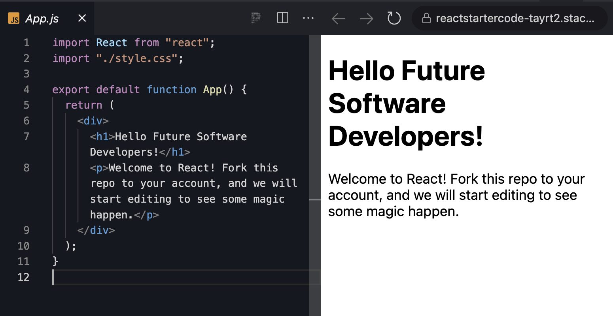
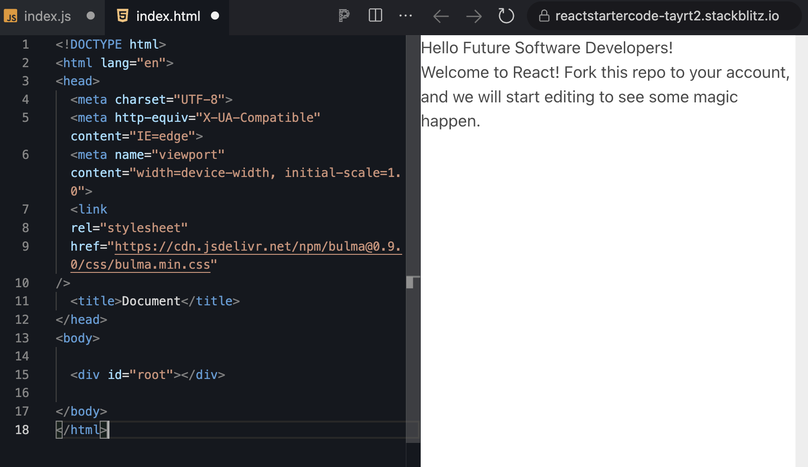
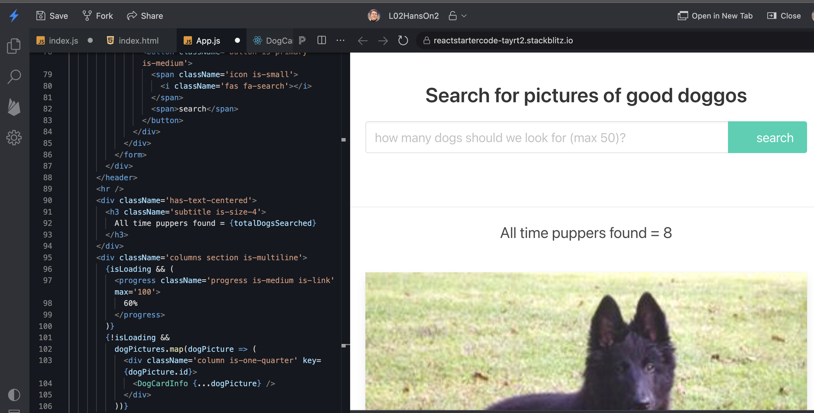

##   L02HandsOnProject2: Build the Furry Friends Gallery

This code-along assignment walks through building a fully-functioning picture gallery; the Furry Friend Gallery.

### Requirements

1. Read all the guided learning text carefully for understanding.
2. Follow all instructions and coding step-by-step.
3. Create all files and folders.
4. Complete all coding as demonstrated in all files.
5. Zip `L02ReactHandsOnPProject2` Folder
6. Attach the zipped folder below where indicated for submission.

### ANNOUNCEMENT

At this point, you will be coding functions, objects, and imports. The live preview will not always diplay something after each code block, because many times, to render requires what you have not yet coded.

- Unless you are receiving errors, everything is fine. Just keeo coding. You will know when something should display, because there will be a screenshot here in the instructions of what it should resemble,

### Introduction

As you experienced in the quick code along of the Furry Friend Gallery, you will build an app that talks to your familiar Dog CEO API, loads in a few starter pictures before turning control over to the user, allowing them to choose several images they’d like to fetch.

### [Create React App (CRA) Starter Project](https://stackblitz.com/edit/reactstartercode?file=src/App.js)

With that out of the way, get started with your new gallery app.

	1. Fork the repository
	2. Name it l02handsonpplication2
	3. Open your newly forked repository to start working on it.

Until now, you used [Parcel JS](https://parceljs.org/) to set up and configure your React apps. It makes sense for smaller projects or apps and there’s certainly no problem with continuing to choose Parcel for more complex needs.

However, out in the real world commercial environments, you often come across React projects with much more complexity around their configuration; from employing static code analysis using a tool like [ESLint](https://eslint.org/) or [Babel JS](https://babeljs.io/) to allow you to use the latest JavaScript features cross-browser, and code bundling and optimization with help from [Webpack](https://webpack.js.org/).

### CRA Advantages

Behind the scenes, the **Create React App** maintains an up-to-date and working configuration that employs modern coding best practices for setting up and working with a React project. It abstracts all of the complex setup required for Webpack to bundle your project’s files, as well as giving you a list of great code linting rules to ensure you’re adhering to generally accepted ‘good code’ standards.

The best part; it can be used to spin up a new project and get coding in under five minutes from just a single terminal command.

### CRA Disadvantages

The biggest drawback to using **Create React App** is also one of its biggest advantages: the abstraction.

Many developers and projects demand more flexibility and control from their configuration. By using **Create React App**, you’re effectively handing over control of these parts of your app to the React team and their own development opinions.


### Test the New Project

Before you do anything else, make sure it’s all working.



**Boom!!** Everything’s looking great and your new project is almost ready to go!


### Clean up the Default Files

*Create React App* does load in a few bare-bones files and styles to give you a jumping-off point. However, you need to make a few changes to get everything cleaned up and ready for your new gallery app.

#### Note!

**React.StrictMode**

Delete the **React.StrictMode** from `index.js`.

- If you use a later version of React for your build-along projects, remove the `<React.StrictMode>` tags from your `index.js` file. Strict mode was a troubleshooting tool that helped identify some common problems in development apps. However, it can also cause some unintended behaviour while you're getting familiar with some of the trickier Hooks, such as `useMemo`. You can read more about [strict](https://reactjs.org/docs/strict-mode.html) mode on the official React docs, but for now turn it off for this app, and I recommend doing the following for all of the upcoming projects too. 

- To remove strict mode from your app, in the `index.js` file, locate the code around line 9-10 that looks like this `<React.StrictMode>` and remove it. Also, find its matching closing tag, `</React.StrictMode>` a few lines further down and remove that too.

- Delete the `React.StrictMode` import from top of `index.js`.

**index.css**

Delete the `index.css` file.

Once you remove strict mode and the default `index.css` file, and add your import statements, your `index.js` file should look like this:

**index.js**

```
import React from 'react';
import ReactDOM from 'react-dom/client';
import App from './App';
import reportWebVitals from './reportWebVitals';

const root = ReactDOM.createRoot(document.getElementById('root'));
root.render(  
    <App />
);

// If you want to start measuring performance in your app, pass a function
// to log results (for example: reportWebVitals(console.log))
// or send to an analytics endpoint. Learn more: https://bit.ly/CRA-vitals
reportWebVitals();
```

### Bulma CSS Framework

CSS frameworks, much like JavaScript frameworks and libraries such as React itself, allow you to employ some well-used and well-tested conventions to help build user interfaces more quickly.

CSS frameworks specifically, give you access to a design system, providing many individual elements, like buttons and heroes, that often combine into larger components, each maintaining the correct look and feel. They also offer layout systems, such as grids or column-based layouts.

You’ll be using one frequently throughout this course, the [Bulma CSS](https://bulma.io/documentation/components/card/) framework. It’s quite lightweight, simple to implement, and is based on modern CSS using Flexbox for much of its layout options.

It can be loaded via an `npm` package or simply dropped into an `HTML` file as an external stylesheet resource (which you’ll be doing here). There is even a React-based component library you can add to your project.

Take a look at the [Bulma doc](https://bulma.io/documentation/s) to familiarize yourself with the elements and components. For now,you’ll be adding to your app and using the CSS classes it gives to build your components.

## Create your Furry Friends Files

Your project will consist of just three files:

1. `App.js` —** already exists** and this is where the main action takes place

2. `DogCardInfo.jsx` — **create this file** in `src` folder; a reusable list item component to display each picture

3. `App.css` - **create this file** in `src` folder; you’ll need to add a couple of styles here to tweak the look and feel of your gallery list items

4. `style.css` - delete this file.

You also need to make a line change in your `index.html` file that loads the Bulma CSS framework for you.

Let’s start there.

### Edit index.html

Navigate to `/public/index.html` and open the file. This is the main starting template `HTML` file the project uses to render the initial output of the app. It’s well commented and you can easily see what does what.

	- Create `HTML` Starter code
		- `!` enter

To load Bulma so you can take advantage of the styles, add the following line somewhere between the opening and closing `<head></head>` tags:

**index.html**

```
<!DOCTYPE html>
<html lang="en">
<head>
  <meta charset="UTF-8">
  <meta http-equiv="X-UA-Compatible" content="IE=edge">
  <meta name="viewport" content="width=device-width, initial-scale=1.0">
  <link
  rel="stylesheet"
  href="https://cdn.jsdelivr.net/npm/bulma@0.9.0/css/bulma.min.css"
/>
  <title>Document</title>
</head>
<body>

  <div id="root"></div>
  
</body>
</html>
```


You can also edit the title of the page between the `<title></title>` tags if you wish.

### Create DogInfoCard.jsx

`DogInfoCard` will be a presentational component. It deals with the presentational aspects. but usually no logic (or very little). A presentational component will accept one or more values as props or direct arguments and simply return a block of JSX to render out.

- If you haven't already, create a new file in the `/src` directory called `DogInfoCard.jsx` and drop in the following contents:

**DogInfoCard.jsx**

```
import React from 'react';

export default ({ imgUrl, breed }) => (
  <div className='card dog-card'>
    <div className='card-image'>
      <figure className='image' style={{ backgroundImage: `url(${imgUrl})` }}>
        
      </figure>
    </div>
    <div className='card-content'>
      <div className='content'>
        <strong>breed:</strong> {breed}
      </div>
    </div>
  </div>
);
```

- We used the destructuring syntax again to break the `imgUrl` and breed values out from the props object supplied to this component.

- The markup here is based on Bulma’s card component. The subtle difference is you’ve employed a little image display trick on the figure element.

- Because the dog images are returned from the API in different sizes and aspect ratios, you can’t just drop them directly in using an `` tag. You could, but they’d look wonky and misshapen.

- Apply the image to the figure element as a background, which (via some styling you’ll take care of next) allows more control of how things look when the images are weird sizes and shapes.

- However, to keep things nice and semantic and look after those users working with screen-readers, use an `` tag with the correct `src` and `alt` attributes, but apply a handy helper class, ‘`is-sr-only`’ which means the image won’t be visible on screen.

- Render the breed name into the ‘`card-content`’ `div` as a nice addition so people can see what breed they’re looking at.

### Edit App.css

You have your list item display component ready. Add a handful of styles into the `/src/App.css` file, which is loaded in at the top of our `App.js` file.

**App.css**

```
.dog-card .card-image {
  height: 15em;
}

.dog-card .image {
  height: 100%;
  background-repeat: no-repeat;
  background-position: top center;
  background-size: cover;
}
```


Nothing complicated, but you added a height to the main image container from the `DogCardInfo.jsx` component, otherwise it would collapse because its child, the image element, is hidden.

You also apply some background styles to the child figure element so the background is sized properly and doesn’t repeat.

### Edit App.js

Start by importing what you need, and add the `App` function.

- In your case the React defaults, your `DogCardInfo` component, and your main styles, `App.css`.

**App.js**

```
import React, { useState, useEffect } from 'react';

// components
import DogCardInfo from './DogCardInfo';

// styles
import './App.css';


function App() {

}

export default App;

```

### The loadDogPictures() Function

Next, outside of the main `App` component, define a new asynchronous function, `loadDogPictures()`, which will do exactly that; load a set of pictures from the API.

**App.js**

```
import React, { useState, useEffect } from 'react';

// components
import DogCardInfo from './DogCardInfo';

// styles
import './App.css';

const loadDogPictures = async (dogsToLoad = 8) => {
  // TODO: load in some cute dogs
};

function App() {

}

export default App;
```

Here, define the outline of the function, adding the `async` keyword before your single argument, `dogsToLoad`. Set as a default to ‘`8`’. So, specify a number of dogs' pictures to fetch from the API or leave it blank and you’ll get eight back.

Next, add your variables:

**App.js**

```
import React, { useState, useEffect } from 'react';

// components
import DogCardInfo from './DogCardInfo';

// styles
import './App.css';

const loadDogPictures = async (dogsToLoad = 8) => {
  // TODO: load in some cute dogs

const apiBaseUrl = 'https://dog.ceo/api/breeds/image/random/';
const response = await fetch(`${apiBaseUrl}${dogsToLoad}`);
const data = await response?.json();

};

function App() {

}

export default App;
```

You have the static API URL, which is the base URL Dog CEO provides for a single random image. You can append this with a number (to a maximum of fifty) to return that many images.

Next, use the `await` keyword in front of the `fetch()` command which will pause the execution of things until the `fetch` method finishes up and returns. Notice how you use the template literals version of a String here to combine the base API URL and the number of pictures to fetch.

Perform another `await` as you call to the `json()` method on the response from the API call. This will get your dog-related data in a nice, malleable JSON format, ready for doing with as you please.

What happens next is some manipulation of the data returned from the API. In its raw state, the API returns something like this:

**EXAMPLE ONLY**

```
{
 "messages": [
    "https://images.dog.ceo/breeds/terrier-cairns/n02983056_1127.jpg"
    "https://images.dog.ceo/breeds/bullterrier-staffordshire/n02093256_1727.jpg"
    "https://images.dog.ceo/breeds/rottweiler/v983763017594_9910.jpg"
 ]
 //...other info
}
```

Loop through the image URLs in the messages array, capture the URL, generate an `id` value, and work out the breed.

Start by using `map()` to look at each image URL in turn.


**App.js**

```
import React, { useState, useEffect } from 'react';

// components
import DogCardInfo from './DogCardInfo';

// styles
import './App.css';

const loadDogPictures = async (dogsToLoad = 8) => {
  // TODO: load in some cute dogs


const apiBaseUrl = 'https://dog.ceo/api/breeds/image/random/';
const response = await fetch(`${apiBaseUrl}${dogsToLoad}`);
const data = await response?.json();

const dogData = data.message.map(item => {
  // item is an image url in the format:
  // "https://images.dog.ceo/breeds/bullterrier-staffordshire/n02093256_1727.jpg",
  let breed = item.replace('https://', '').split('/')[2];

  // bread clean up (i.e. starts in the format 'subtype-maintype')
  if (breed && breed !== '') {
    breed = breed.split('-').reverse().join(' ');
  }

  return {
    id: `dog_pic_${data.message.indexOf(item)}`,
    imgUrl: item,
    breed
  };
});

}

function App() {


}

export default App;
```

Work out the breed by manipulating the URL string, removing the protocol, splitting the rest of the URL on the forward-slash character, and pull the breed from the item in the third position in this array.

Next, split the breed string by the dash character and reverse it. For some reason, that’s how the Dog CEO people log their breed information, in reverse name order.

Finally, wrap this up by returning an object to this iteration of the map we populate with a simply generated `id` from the index of the imagRL in the original list, the image URL, and the breed name.

Once you have all that, return the array of dog item objects.

The full function looks like this:

**App.js**


```
import React, { useState, useEffect } from 'react';

// components
import DogCardInfo from './DogCardInfo';

// styles
import './App.css';

const loadDogPictures = async (dogsToLoad = 8) => {
  // TODO: load in some cute dogs


const apiBaseUrl = 'https://dog.ceo/api/breeds/image/random/';
const response = await fetch(`${apiBaseUrl}${dogsToLoad}`);
const data = await response?.json();

const dogData = data.message.map(item => {
  // item is an image url in the format:
  // "https://images.dog.ceo/breeds/bullterrier-staffordshire/n02093256_1727.jpg",
  let breed = item.replace('https://', '').split('/')[2];

  // bread clean up (i.e. starts in the format 'subtype-maintype')
  if (breed && breed !== '') {
    breed = breed.split('-').reverse().join(' ');
  }

  return {
    id: `dog_pic_${data.message.indexOf(item)}`,
    imgUrl: item,
    breed
  };
});

return dogData;
};

function App() {

}

export default App;
```


## App.js variables

As with all good components, start with the variables you will use. Define these at the top of the component to be used as you go along.

**App.js**

```
import React, { useState, useEffect } from 'react';

// components
import DogCardInfo from './DogCardInfo';

// styles
import './App.css';

const loadDogPictures = async (dogsToLoad = 8) => {
  // TODO: load in some cute dogs


const apiBaseUrl = 'https://dog.ceo/api/breeds/image/random/';
const response = await fetch(`${apiBaseUrl}${dogsToLoad}`);
const data = await response?.json();

const dogData = data.message.map(item => {
  // item is an image url in the format:
  // "https://images.dog.ceo/breeds/bullterrier-staffordshire/n02093256_1727.jpg",
  let breed = item.replace('https://', '').split('/')[2];

  // bread clean up (i.e. starts in the format 'subtype-maintype')
  if (breed && breed !== '') {
    breed = breed.split('-').reverse().join(' ');
  }

  return {
    id: `dog_pic_${data.message.indexOf(item)}`,
    imgUrl: item,
    breed
  };
});

return dogData;
};

function App() {
  const [dogPictures, setDogPictures] = useState([]);
  const [isLoading, setIsLoading] = useState(false);
  const [numOfDogs, setNumOfDogs] = useState('');
  const [totalDogsSearched, setTotalDogsSearched] = useState(0);

}

export default App;
```

You have `dogPictures` which you create as an empty array to hold loaded dog picture objects, `isLoading` to determine if the component is in the process of fetching the dog photos, `numOfDogs` to track the user input on how many pictures they’d like to load, and `totalDogsSearched` which is a running total of how many pictures have been fetched in total.

### handleSubmit() function

You need a way to handle your form submissions and that’s where the `handleSubmit()` function comes in.

**App.js**

```
import React, { useState, useEffect } from 'react';

// components
import DogCardInfo from './DogCardInfo';

// styles
import './App.css';

const loadDogPictures = async (dogsToLoad = 8) => {
  // TODO: load in some cute dogs


const apiBaseUrl = 'https://dog.ceo/api/breeds/image/random/';
const response = await fetch(`${apiBaseUrl}${dogsToLoad}`);
const data = await response?.json();

const dogData = data.message.map(item => {
  // item is an image url in the format:
  // "https://images.dog.ceo/breeds/bullterrier-staffordshire/n02093256_1727.jpg",
  let breed = item.replace('https://', '').split('/')[2];

  // bread clean up (i.e. starts in the format 'subtype-maintype')
  if (breed && breed !== '') {
    breed = breed.split('-').reverse().join(' ');
  }

  return {
    id: `dog_pic_${data.message.indexOf(item)}`,
    imgUrl: item,
    breed
  };
});

return dogData;
};

function App() {
  const [dogPictures, setDogPictures] = useState([]);
  const [isLoading, setIsLoading] = useState(false);
  const [numOfDogs, setNumOfDogs] = useState('');
  const [totalDogsSearched, setTotalDogsSearched] = useState(0);

  const handleSubmit = async e => {
    e.preventDefault();
    setIsLoading(true);
    setDogPictures(await loadDogPictures(numOfDogs));
    setIsLoading(false);
  };

}

export default App;
```

First, prevent the form from causing a page reload (as that will just kill off your app’s functionality) by calling `e.preventDefault()`; then toggle the `isLoading` state value to ‘`true`’ (which will be used later to set visibility on some of your UI elements); Once you’re loading, trigger a `fetch()` from the API via the `loadDogPictures()` function.

Last but not least, toggle `isLoading` back to ‘`false`’ once you have your pictures.

Notice the use of JavaScript’s built-in async/await pairing in use in this function.

## useEffect Hooks

This is where things get a little more interesting. You use two separate calls to the `useEffect` Hook to handle two side-effects.

Let’s deal with the first:

**App.js**

```
import React, { useState, useEffect } from 'react';

// components
import DogCardInfo from './DogCardInfo';

// styles
import './App.css';

const loadDogPictures = async (dogsToLoad = 8) => {
  // TODO: load in some cute dogs


const apiBaseUrl = 'https://dog.ceo/api/breeds/image/random/';
const response = await fetch(`${apiBaseUrl}${dogsToLoad}`);
const data = await response?.json();

const dogData = data.message.map(item => {
  // item is an image url in the format:
  // "https://images.dog.ceo/breeds/bullterrier-staffordshire/n02093256_1727.jpg",
  let breed = item.replace('https://', '').split('/')[2];

  // bread clean up (i.e. starts in the format 'subtype-maintype')
  if (breed && breed !== '') {
    breed = breed.split('-').reverse().join(' ');
  }

  return {
    id: `dog_pic_${data.message.indexOf(item)}`,
    imgUrl: item,
    breed
  };
});

return dogData;
};

function App() {
  const [dogPictures, setDogPictures] = useState([]);
  const [isLoading, setIsLoading] = useState(false);
  const [numOfDogs, setNumOfDogs] = useState('');
  const [totalDogsSearched, setTotalDogsSearched] = useState(0);

  const handleSubmit = async e => {
    e.preventDefault();
    setIsLoading(true);
    setDogPictures(await loadDogPictures(numOfDogs));
    setIsLoading(false);
  };
  useEffect(() => {
    setTotalDogsSearched(totalDogs => totalDogs + dogPictures.length);
  }, [dogPictures]);

}

export default App;
```

This Hook call is just one line, but notice you passed in `dogPictures` into the dependency array. What you’re saying here is ‘when `dogPictures` changes, execute whatever code is inside of the `useEffect` call’.

Inside the body of the function, set the `totalDogsSearched` value in state to the current value plus the length of the new array of pictures you’ll have when the value of `dogPictures` changes.

You might be wondering about the unusual way you called the `setTotalDogsSearched()` function to update the `totalDogsSearched` value. Previously, you just passed in the new value you wish state to have, and that’s the way you usually do things.

However, if you did that here, although it would technically work, you’d be breaking one of the rules of Hooks and you’d most likely get an ESLint error that looks like this:

```
React Hook useEffect has a missing dependency: ‘totalDogsSearched’. Either include it or remove the dependency array. You can also do a functional update ‘setTotalDogsSearched(t => …)’ if you only need ‘totalDogsSearched’ in the ‘setTotalDogsSearched’ call. (react-hooks/exhaustive-deps)
```

Because you’re referencing a value from your component (in this case, the state value `totalDogsSearched`) but not including it in the list of dependencies passed to `useEffect` you get this error. It’s a potential problem because you run the risk of using stale data. Each time the component updates, changes, or rerenders the value of `totalDogsSearched` could be different. You’re referencing that value and so you can see how it could cause problems.

However, if you include it in the dependencies array, you most likely run into an infinite loop because this effect will then be called when dogPictures or `totalDogsSearched` changes. But of course, you are changing `totalDogsSearched` so you can update your UI. Every time it changes, you call the `setTotalDogsSearched()` function to update it, then the effect runs again, and so on until our app stops working.

The basic rule of thumb is; if you’re going to reference a function or a value from state or props inside of `useEffect`, then you must include it in the dependency array.

There is much more information available on this subject if you head over to the official [React documentation](https://reactjs.org/docs/hooks-faq.html#what-can-i-do-if-my-effect-dependencies-change-too-often).

However, you fix this by using the functional form of the state update method. So, instead of passing a direct value into the `setTotalDogsSearched()` function to update the value in state, you pass it a function, which will receive the current value from state as an argument.

This fixes the potential ‘stale data’ error you might run into and doesn’t run foul of the Hooks rules.

Define one last use of your `useEffect` Hook you’ll call with an empty dependency array, so it’s only triggered on the first component mount. In here, make sure you kick off an initial load of some dog pictures to populate our app with.

:writing_hand:

**App.js**
```
import React, { useState, useEffect } from 'react';

// components
import DogCardInfo from './DogCardInfo';

// styles
import './App.css';

const loadDogPictures = async (dogsToLoad = 8) => {
  // TODO: load in some cute dogs


const apiBaseUrl = 'https://dog.ceo/api/breeds/image/random/';
const response = await fetch(`${apiBaseUrl}${dogsToLoad}`);
const data = await response?.json();

const dogData = data.message.map(item => {
  // item is an image url in the format:
  // "https://images.dog.ceo/breeds/bullterrier-staffordshire/n02093256_1727.jpg",
  let breed = item.replace('https://', '').split('/')[2];

  // bread clean up (i.e. starts in the format 'subtype-maintype')
  if (breed && breed !== '') {
    breed = breed.split('-').reverse().join(' ');
  }

  return {
    id: `dog_pic_${data.message.indexOf(item)}`,
    imgUrl: item,
    breed
  };
});

return dogData;
};

function App() {
  const [dogPictures, setDogPictures] = useState([]);
  const [isLoading, setIsLoading] = useState(false);
  const [numOfDogs, setNumOfDogs] = useState('');
  const [totalDogsSearched, setTotalDogsSearched] = useState(0);

  const handleSubmit = async e => {
    e.preventDefault();
    setIsLoading(true);
    setDogPictures(await loadDogPictures(numOfDogs));
    setIsLoading(false);
  };
  useEffect(() => {
    setTotalDogsSearched(totalDogs => totalDogs + dogPictures.length);
  }, [dogPictures]);
  useEffect(() => {
    (async () => {
      setIsLoading(loading => !loading);
      const dogPictureData = await loadDogPictures();
      setDogPictures(dogDataArray => [...dogPictureData]);
      setIsLoading(loading => !loading);
    })();
  }, []);

}

export default App;
```

Once that’s defined you see you’re using the same form of functional update for setting various state values here. You also wrap all of these updates in a self-executing anonymous function (otherwise known as an immediately invoked function expression) that employs the async/await syntax.


## JSX markup

What would a component be without returning some markup to render your UI?!

Define a simple return statement with a container div element:

**App.js**

```
import React, { useState, useEffect } from 'react';

// components
import DogCardInfo from './DogCardInfo';

// styles
import './App.css';

const loadDogPictures = async (dogsToLoad = 8) => {
  // TODO: load in some cute dogs


const apiBaseUrl = 'https://dog.ceo/api/breeds/image/random/';
const response = await fetch(`${apiBaseUrl}${dogsToLoad}`);
const data = await response?.json();

const dogData = data.message.map(item => {
  // item is an image url in the format:
  // "https://images.dog.ceo/breeds/bullterrier-staffordshire/n02093256_1727.jpg",
  let breed = item.replace('https://', '').split('/')[2];

  // bread clean up (i.e. starts in the format 'subtype-maintype')
  if (breed && breed !== '') {
    breed = breed.split('-').reverse().join(' ');
  }

  return {
    id: `dog_pic_${data.message.indexOf(item)}`,
    imgUrl: item,
    breed
  };
});

return dogData;
};

function App() {
  const [dogPictures, setDogPictures] = useState([]);
  const [isLoading, setIsLoading] = useState(false);
  const [numOfDogs, setNumOfDogs] = useState('');
  const [totalDogsSearched, setTotalDogsSearched] = useState(0);

  const handleSubmit = async e => {
    e.preventDefault();
    setIsLoading(true);
    setDogPictures(await loadDogPictures(numOfDogs));
    setIsLoading(false);
  };
  useEffect(() => {
    setTotalDogsSearched(totalDogs => totalDogs + dogPictures.length);
  }, [dogPictures]);
  useEffect(() => {
    (async () => {
      setIsLoading(loading => !loading);
      const dogPictureData = await loadDogPictures();
      setDogPictures(dogDataArray => [...dogPictureData]);
      setIsLoading(loading => !loading);
    })();
  }, []);
  
  return <div className='container'></div>;

}

export default App;
```

Here, you need two sections: one for the search form and another to render the dog pictures.

First, define the `header` and search form.

**App.js**

```
     import React, { useState, useEffect } from 'react';

// components
import DogCardInfo from './DogCardInfo';

// styles
import './App.css';

const loadDogPictures = async (dogsToLoad = 8) => {
  // TODO: load in some cute dogs


const apiBaseUrl = 'https://dog.ceo/api/breeds/image/random/';
const response = await fetch(`${apiBaseUrl}${dogsToLoad}`);
const data = await response?.json();

const dogData = data.message.map(item => {
  // item is an image url in the format:
  // "https://images.dog.ceo/breeds/bullterrier-staffordshire/n02093256_1727.jpg",
  let breed = item.replace('https://', '').split('/')[2];

  // bread clean up (i.e. starts in the format 'subtype-maintype')
  if (breed && breed !== '') {
    breed = breed.split('-').reverse().join(' ');
  }

  return {
    id: `dog_pic_${data.message.indexOf(item)}`,
    imgUrl: item,
    breed
  };
});

return dogData;
};

function App() {
  const [dogPictures, setDogPictures] = useState([]);
  const [isLoading, setIsLoading] = useState(false);
  const [numOfDogs, setNumOfDogs] = useState('');
  const [totalDogsSearched, setTotalDogsSearched] = useState(0);

  const handleSubmit = async e => {
    e.preventDefault();
    setIsLoading(true);
    setDogPictures(await loadDogPictures(numOfDogs));
    setIsLoading(false);
  };
  useEffect(() => {
    setTotalDogsSearched(totalDogs => totalDogs + dogPictures.length);
  }, [dogPictures]);
  useEffect(() => {
    (async () => {
      setIsLoading(loading => !loading);
      const dogPictureData = await loadDogPictures();
      setDogPictures(dogDataArray => [...dogPictureData]);
      setIsLoading(loading => !loading);
    })();
  }, []);
  
  return  (
  <header className='columns section has-text-centered'>
  <div className='column is-6 is-offset-3'>
    <h1 className='title is-size-3'>
      Search for pictures of good doggos
    </h1>
    <form className='form' onSubmit={handleSubmit}>
      <div className='field has-addons has-addons-centered'>
        <div className='control is-expanded'>
          <input
            type='text'
            className='input is-medium'
            placeholder='how many dogs should we look for (max 50)?'
            value={numOfDogs}
            onChange={e => setNumOfDogs(e.target.value)}
          />
        </div>
        <div className='control'>
          <button className='button is-primary is-medium'>
            <span className='icon is-small'>
              <i className='fas fa-search'></i>
            </span>
            <span>search</span>
          </button>
        </div>
      </div>
    </form>
  </div>
</header>
  )
}

export default App;
```

You have a heading level three element where you display the total number of pictures searched for using the `totalDogsSearched` value in state.

Next, show an animated progress bar if the `isLoading` value is set to ‘`true`’.

Similarly, if `isLoading` is ‘`false`’, map over the `dogPictures` array in state, returning a new `DogCardInfo` component for each item in the array. This component is wrapped in a `div` with a ‘`column`’ class that will automatically render them side-by-side in the UI.

### The complete App.js file

Here’s the complete **App.js**

**App.js**

```
import React, { useState, useEffect } from 'react';

// components
import DogCardInfo from './DogCardInfo';

// styles
import './App.css';

const loadDogPictures = async (dogsToLoad = 8) => {
  const apiBaseUrl = 'https://dog.ceo/api/breeds/image/random/';
  const response = await fetch(`${apiBaseUrl}${dogsToLoad}`);
  const data = await response?.json();
  const dogData = data.message.map(item => {
    // item is an image url in the format:
    // "https://images.dog.ceo/breeds/bullterrier-staffordshire/n02093256_1727.jpg",
    let breed = item.replace('https://', '').split('/')[2];

    // bread clean up (i.e. starts in the format 'subtype-maintype')
    if (breed && breed !== '') {
      breed = breed.split('-').reverse().join(' ');
    }

    return {
      id: `dog_pic_${data.message.indexOf(item)}`,
      imgUrl: item,
      breed
    };
  });

  return dogData;
};

function App() {
  const [dogPictures, setDogPictures] = useState([]);
  const [isLoading, setIsLoading] = useState(false);
  const [numOfDogs, setNumOfDogs] = useState('');
  const [totalDogsSearched, setTotalDogsSearched] = useState(0);

  const handleSubmit = async e => {
    e.preventDefault();
    setIsLoading(true);
    setDogPictures(await loadDogPictures(numOfDogs));
    setIsLoading(false);
  };

  useEffect(() => {
    setTotalDogsSearched(totalDogs => totalDogs + dogPictures.length);
  }, [dogPictures]);

  useEffect(() => {
    (async () => {
      setIsLoading(loading => !loading);
      const dogPictureData = await loadDogPictures();
      setDogPictures(dogDataArray => [...dogPictureData]);
      setIsLoading(loading => !loading);
    })();
  }, []);

  return (
    <div className='container'>
      <header className='columns section has-text-centered'>
        <div className='column is-6 is-offset-3'>
          <h1 className='title is-size-3'>
            Search for pictures of good doggos
          </h1>
          <form className='form' onSubmit={handleSubmit}>
            <div className='field has-addons has-addons-centered'>
              <div className='control is-expanded'>
                <input
                  type='text'
                  className='input is-medium'
                  placeholder='how many dogs should we look for (max 50)?'
                  value={numOfDogs}
                  onChange={e => setNumOfDogs(e.target.value)}
                />
              </div>
              <div className='control'>
                <button className='button is-primary is-medium'>
                  <span className='icon is-small'>
                    <i className='fas fa-search'></i>
                  </span>
                  <span>search</span>
                </button>
              </div>
            </div>
          </form>
        </div>
      </header>
      <hr />
      <div className='has-text-centered'>
        <h3 className='subtitle is-size-4'>
          All time puppers found = {totalDogsSearched}
        </h3>
      </div>
      <div className='columns section is-multiline'>
        {isLoading && (
          <progress className='progress is-medium is-link' max='100'>
            60%
          </progress>
        )}
        {!isLoading &&
          dogPictures.map(dogPicture => (
            <div className='column is-one-quarter' key={dogPicture.id}>
              <DogCardInfo {...dogPicture} />
            </div>
          ))}
      </div>
    </div>
  );
}

export default App;
```


### View Your Hard Work

With everything coded up and set to go, that just leaves you to complete a final check to make sure everything’s working as it should.



If everything’s working as planned, you should have a great looking site that shows us nothing but some well-behaved dogs doing what they do best.

#### Submission

1. Zip the Project Folder
2. Upload the zipped folder

