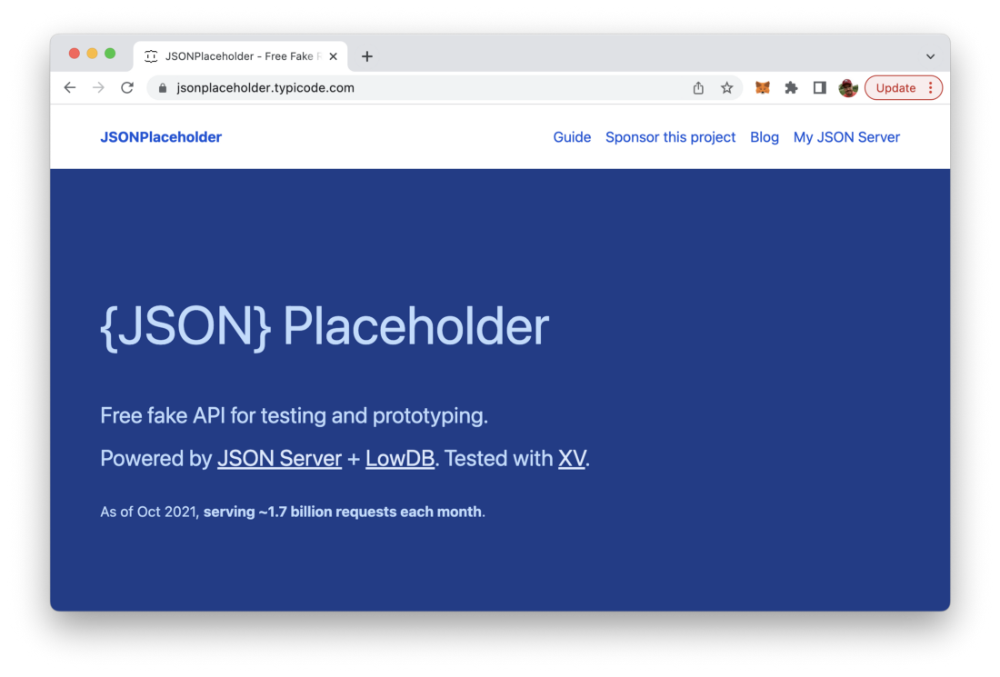
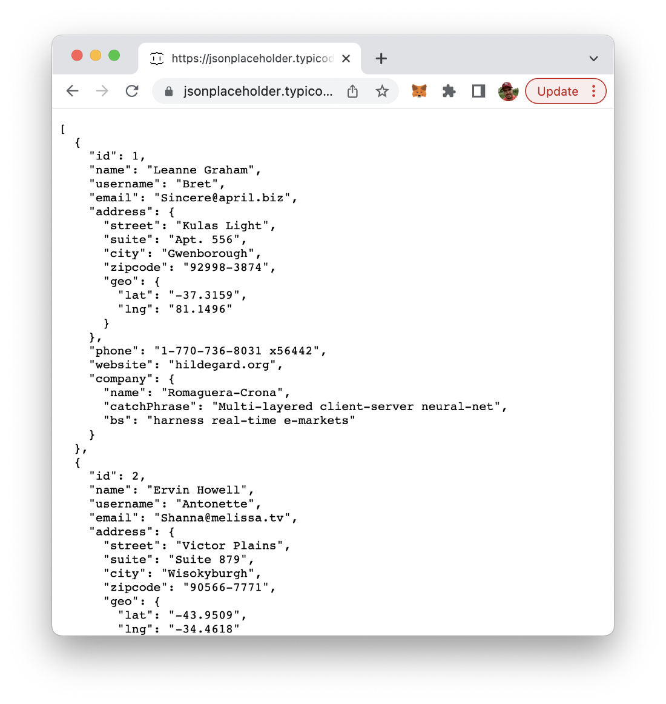
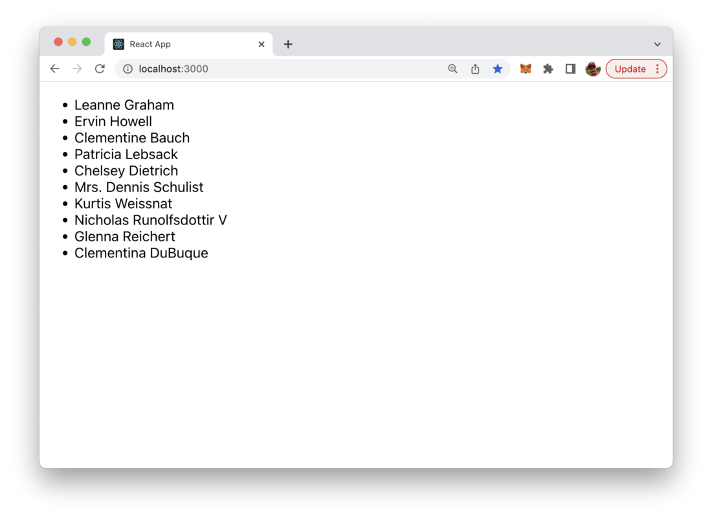

## L03 HandsOn Assignment

### Requirements

1. Read all the guided learning text carefully for understanding.
2. Follow all instructions and coding step-by-step.
3. Create all files and folders for the Greeting App.
4. Complete all coding as demonstrated in all files.
5. "Share" your StackBlitz Project and place URL on text document.
5. Zip `L03ReactHandsOnProject` Folder
6. Attach the zipped folder with text and project below where indicated for submission.


### ANNOUNCEMENT

At this point, you will be coding functions, objects, and imports. The live preview will not always diplay something after each code block, because many times, to render requires what you have not yet coded.

- Unless you are receiving errors, everything is fine. Just keeo coding. You will know when something should display, because there will be a screenshot here in the instructions of what it should resemble,

### Introduction

Fetching data from third-party RESTful APIs in React applications is a common task when creating web applications. This task can be solved easily by using the standard **JavaScript Fetch API** in your React application.

The **Fetch API** is a new standard to make server requests with Promises, but which also includes additional features. This short hands on will guide you through the simple steps of using the **Fetch API** for external data fetching within your React application. Let’s get started …


### [Create React App (CRA) Starter Project](https://stackblitz.com/edit/react-rna3ga?file=src/App.js)

With that out of the way, get started with your new app.

	1. Fork the repository
	2. Name it l03handsonpplication
	3. Open your newly forked repository to start working on it.

Once the project’s built, you should be able to see The Welcome Message in Preview. 

### Select a data source

Next we need an external data source we can use to retrieve data from. I use a service which is free to use and is offering multiple endpoints with `JSON` formatted test data,  is `JSONPlaceholder` available at https://jsonplaceholder.typicode.com/:



Here we’ll be using the users endpoint to retrieve user sample data for our React application:



### Use Fetch API to retrieve data

Let’s return to the newly created React project and add the JavaScript code needed to retrieve data from the `JSONPlaceholder` REST endpoint.

Open file `src/App.js` and change the default App component implementation to the following:

**App.js**

```
import React from "react"

const App = () => {
  return (
    <div>
      Test
    </div>
  );
}

export default App;
```

Next add the following import statement on top:

```
import React, { useEffect, useState } from “react”;

const App = () => {
  return (
    <div>
      Test
    </div>
  );
}

export default App;
```

By using this import statement we’re making sure we’re able to make use of React’s `useEffect` and `useState` hook.

Inside `App` function introduce a new users component state which will later hold our retrieved user sample data by using the `useState` hook:

```
import React, { useEffect, useState } from “react”;

const App = () => {

  const [users, setUsers] = useState([])

  return (
    <div>
      Test
    </div>
  );
}

export default App;
```

Next, add a function `fetchUserData` which uses the **Fetch API`` to retrieve data from the users endpoint of the ``JSONPlaceholder`` service:

```
import React, { useEffect, useState } from "react"

const App = () => {
  const [users, setUsers] = useState([])

  const fetchUserData = () => {
    fetch("https://jsonplaceholder.typicode.com/users")
      .then(response => {
        return response.json()
      })
      .then(data => {
        setUsers(data)
      })
  }
  
  return (
    <div>
      Test
    </div>
  );
}

export default App;
```

If the data is retrieved successfully we’re calling `setUsers` function to set the component user state to the data which was retrieved.

### Make sure data fetching is executed everytime your React app loads

Next we need to make sure `fetchUserData` is executed. We want it to be executed everytime `App` component loads. This can be achieved by using the `useEffect` hook in the following way:

```
import React, { useEffect, useState } from "react"

const App = () => {
  const [users, setUsers] = useState([])

  const fetchUserData = () => {
    fetch("https://jsonplaceholder.typicode.com/users")
      .then(response => {
        return response.json()
      })
      .then(data => {
        setUsers(data)
      })
  }

  useEffect(() => {
  fetchUserData()
}, [])

  
  return (
    <div>
      Test
    </div>
  );
}

export default App;
```

### Output fetched data
Finally we need to show the retrieved data to the user. Change the return statement of App component to what you can see in the following code listing:

```
import React, { useEffect, useState } from "react"

const App = () => {
  const [users, setUsers] = useState([])

  const fetchUserData = () => {
    fetch("https://jsonplaceholder.typicode.com/users")
      .then(response => {
        return response.json()
      })
      .then(data => {
        setUsers(data)
      })
  }

  useEffect(() => {
    fetchUserData()
  }, [])

  return (
    <div>
      {users.length > 0 && (
        <ul>
          {users.map(user => (
            <li key={user.id}>{user.name}</li>
          ))}
        </ul>
      )}
    </div>
  );
}

export default App;
```

This code iterates to the data which stored in users state and outputs the name of each user as a list item.

#### You should be able to see the following result in the browser:



### Done, that’s it! 

6 easy steps and the goal is achieved: user sample data has been retrieved from a third-party service in your React application by using JavaScript’s **Fetch API** and outputted in the browser. 

That’s how easy it is to retrieve API data with React!


### Submit

Include the submit zip folder box here.
