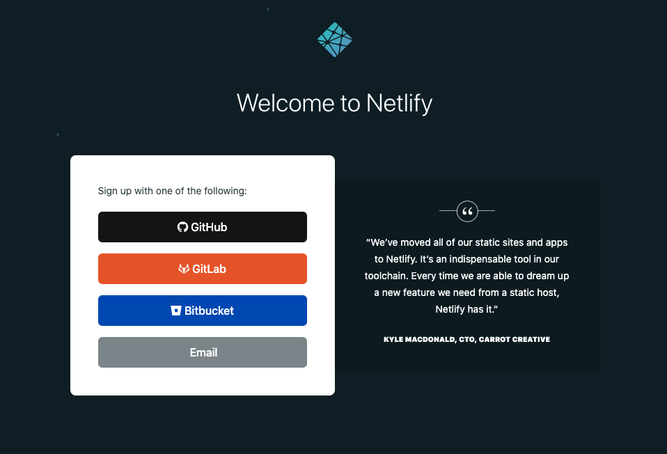
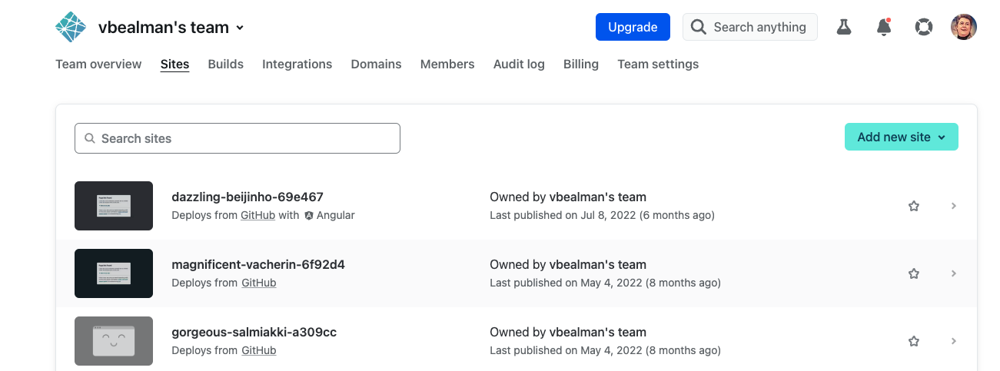
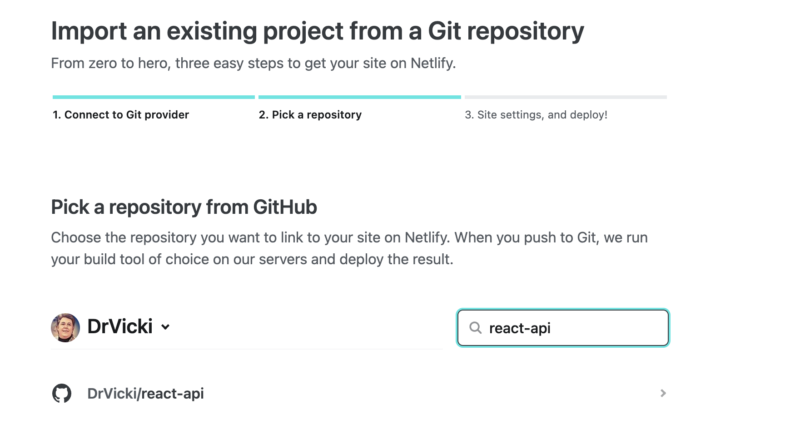
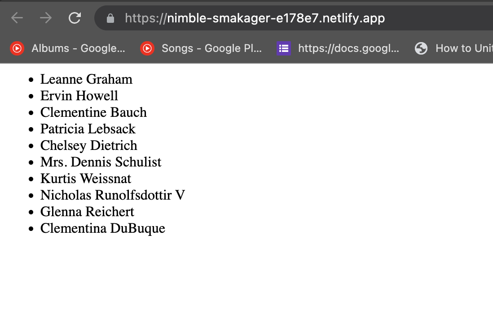
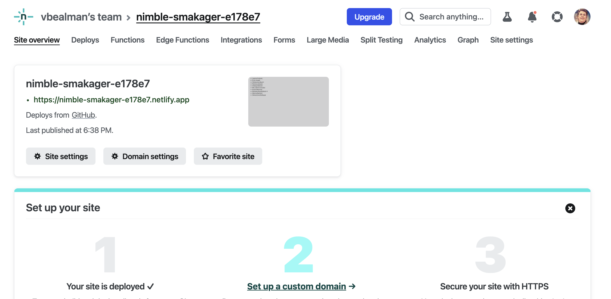

##  L04HandsOnAssignment

### Requirements

1. Follow all instructions below
2. Deploy your App to Netlify
3. Provide URL to the deployed application

### Step One - Create a New Account on Netlify

This is the easy part. Head to [Netlify](https://www.netlify.com/) and you’ll be greeted with the company’s landing page. Look for the ‘Sign up ->’ button on the top right-hand side of the screen and click it.

You’ll be taken to the signup screen, which will look like this:




Netlify offers a range of options, including a simple email/password combination.

 - Sign up with your GitHub account.

You need to be logged in with GitHub, as it is arguably the most common. However, even if you choose another provider, the meat and potatoes of the lesson here will work in the same way. The main differences will be around signin, choosing your repository, and any special GitHub commands.

### Step Two - Create a New Project for L04HandsOn

When you sign up using GitHub you’ll be whisked off to their specific signin screen to authenticate and then authorize Netlify to read your repository information.

Once authorized, you’ll be taken to the Netlify dashboard. Here’s mine:




On the dashboard, you have easy access to high-level account settings, such as domains, builds, billing, and any team members you have.

- You see on my dashboard a list of my Netlify-hosted projects.

	- If I were to click on one of these, I’ll be taken to a sub-dashboard with specific information related to this site, such as deploys, previews, and settings. You look at this screen in more depth shortly, but for now, add a new project!

Hit the green **Add New Site** button at the top right of the dashboard and you’ll be taken through the new site wizard.

### Connect to Git Provider

The first step in the wizard is to choose the source for the  app.



In your case, choose **GitHub**. Click the GitHub button and you may see a popup asking to authenticate to your GitHub account. Once you’ve done that, you’ll be returned to the new site wizard and will be moved onto the next step, picking a repository.

### Pick a Repository

In this step of the wizard, choose the repository where your deployable code is located. You can see mine is called `react-api`` in the screenshot, but yours might be called something different.


Search through your repositories and find the one where your app is located. Click on it to choose it and you’ll be moved onto the final part in the wizard, build options and deploy.


### Build Options and Deploy

So far so good (and simple). There’s a little bit more to this final step, but first, check out the screen to see what’s going on here.


- You see in the first section the chance to assign an owner and a deployment branch. The owner's information is only relevant if you have multiple members in your team or multiple teams. The branch to deploy, however, might differ depending on your Git versioning approach.

- It’s quite common to have a main or master branch in your project. This will be the primary source of truth for the project and where all releases are made from. Leave this selection as main or master or whatever the default branch is unless you have a specific need to deploy your code from a different branch.

- In the basic build settings section, define your build command and directory where Netlify will look to find all the files it needs to deploy.

Netlify does a pretty good job of working out what these values should be based on the type of project you’re deploying.

**IMPORTANT!**

For clarity, you need to know what command to give to Netlify to trigger the build process, as well as the final folder that is output as part of that build process.

- In your case, open the project, and look in the `package.json` file under the scripts section. Since this is a Create React App, you see the command `build`. If you were to build this project yourself manually, in a terminal window you type `npm build`, so that’s what you’ll pass to Netlify in the ‘build command’ input.

```
"scripts": {
  "start": "react-scripts start",
  "build": "react-scripts build",
  "test": "react-scripts test",
  "eject": "react-scripts eject"
},
```

Similarly, if you ran the `npm build` command and let it finish, you’d see a new folder in your project called `/build`. This is the location of the built and processed project files ready to be deployed. 

- So, pass `build` as a folder to the ‘`publish directory`’ input here.


### Advanced Build Options (ONLY WITH FURRY FRIENDS GALLERY)

Usually, this is where you’d leave things and just click the ‘Deploy site’ button. 

- **NOTE**: you need an extra step if you are deploying a successful **Furry Friends Gallery** using environment variables.

- If you are deploying the **r**eact-api** application you can skip thismsection,

At the bottom of this page, look at the ‘Advanced build settings’ section, where it talks about environment variables.

- In the previous section, we introduced the concept of environment variables and how they’re stored in `.env` files. The drawback to `.env` files is they are usually stored on each developer’s local machine and not checked into code versioning systems and are therefore not available to build systems, such as Netlify.

- If you built the Furry Friends Gallery Mark II in the very last lesson, you used two environment variables to access your Dog API, namely `REACT_APP_DOG_API_URL` and `REACT_APP_DOG_API_KEY`.

- So, how do you make these variables available at build time for an app in Netlify? Fortunately, like all good build pipelines, Netlify provides you with the option to add environment variables to be used at build time.

If you take a look toward the bottom of the build settings screen, you see an **Advanced build settings** section.

This is where you add your variables to enable the site to connect with your Dog API.

- Click the ‘New variable’ button twice and you’ll see two sets of two inputs appear that hold `key` and `value` values respectively.

	- Enter your environment variables for the API URL and access key you obtained earlier into these new inputs like this:

	- Use `npm build` vs `yarn build`

#### Click Deploy (All Apps)

With that covered, it’s time to deploy your hard work!

- Hit the green ‘Deploy site’ button and you’ll be taken to the project’s dashboard to check on the build progress.

- Inspect the Build via the Project Dashboard

So here you are, the project dashboard for your project. It should look something like this:


Up at the top of the dashboard, you see a funny looking name. Unless you use a custom domain for the project, Netlify will assign a random three-part name you can use to identify the project in lists and access publicly (once it’s deployed), at an address that looks like https://[your-unique-name].netlify.app. Note, yours will look different from the one I have here.

- This topmost area also holds a preview of the deployed site (once it’s finished) as well as the status of the current build and deploy. Notice that yours is currently set as yellow with a ‘site deploy in progress’ message.

- The other main points of interest here are the ‘Getting started’ section and the ‘Production deploys’ area. ‘Getting started’ is a one-time panel that shows for all new projects you add to Netlify. Once your site has deployed successfully, you’ll be given the option to bring in and use a custom domain, and finally, to add a free SSL certificate. Leave the custom domain and SSL for now as they’re outside the scope of this course, but Netlify has fantastic documentation on custom domains and how to use them in your projects.

		- With ‘Production deploys’ you find a list of the most recent deploys for your project and whether they succeeded or failed. You can inspect each separate build run to see a log of exactly what happened during the build.

### Handling Build Errors

After a while, you should see your project has finished building and then you can view your hard work in all its glory on the public URL.



But oh no, what’s this?! Red text, a warning and a message about ‘site deploy failed’!


Something’s gone wrong with your build and the build has failed. Fortunately, you can step into the specific build run and see what exactly went wrong.

- Looking under the ‘Production deploys’ area of the project dashboard, you see you have at least one build run with a Failed tag in red, next to it.

- Click on the most recently failed build to view the build log. Under this wall of white on black terminal style text, you can scroll down to see the specific point in the build where things went wrong and look for a possible solution.

- The error typically is a rather specific build environment error unique to Netlify. From the middle of 2020, Netlify started adding a CI=true environment variable to all builds on its platform. All build environments such as Netlify will have a list of standard, internal environment variables they make available to projects during builds, but this one causes an easy-to-fix issue with Create React App in particular.

- The main problem here is this automatically injected environment variable `CI=true` causes the build of your project to interpret some rather innocuous warnings as real problems, shutting down the build.

	- You can read all about this specific issue on the [Netlify community blog](https://community.netlify.com/t/new-ci-true-build-configuration-treating-warnings-as-errors-because-process-env-ci-true/14434) where they have an entire thread dedicated to this problem and how to solve it.

Fortunately, it’s a really easy fix that you apply now.

## Step Four - Exploring the Build Settings

Fixing your build error is quite straightforward and only takes a simple change to the build settings, but it also gives a good opportunity to review your build settings and see what else is in there.

- From the project dashboard, click the ‘Site settings’ menu item in the top navigation. Once in the site settings, click the ‘Build & deploy’ link from the left-hand navigation menu.

- This section is where you can discover and edit all the settings related to your site or app's build and deployment. You can change the deployment branch, environment variables, apply post-processing tricks like injecting Google Analytics into your site, and control who gets what notifications.

- For now, however, you’re concerned with the very top box ‘Build settings’. Click the ‘Edit settings’ button and change the ‘Build command:’ input box from yarn build to `CI= npm build`.


- Hit the ‘Save’ button and that’s it: such a simple fix, but now, Netlify will not interfere with our Create React App build and you’ll find things go much more smoothly from now on.

### Triggering a New Deployment

The last thing is to trigger a new build and deploy run. To do that, head over to the ‘Deploys’ section from the top navigation. This area lists the most recent deployments as well as access to deployment settings, notifications, and stopping automatic publishing.

- For your needs, you’re mainly concerned with the ‘Trigger deploy’ select element in the top right of your deployment list. Click ’Trigger deploy’ and then select ‘Deploy site’ to kick off a new site deployment.

- This will add a new deployment item to the existing list and mark it as ‘in progress’. If you click into this new build you can follow along in real-time as Netlify builds the project.


Hopefully, if everything goes according to plan, you reach a nice blue box surrounding the message ‘Netlify Build Complete’. If you reach this point, everything’s built and you’ll be able to go view your deployed project at your very own unique URL.



## Step Five - View the Deployed App

Back at the top of the screen, click the ‘` Deploys`’ link to get back to the Deploys dashboard, and then take a look at the nice  URL under your project name.


Mine will look different from yours, but the point here is you can click this link to open a new screen which will have your lovely application running.


Take a look at your public app.

Although you haven’t really built anything new in this lesson, you covered an awful lot of ground in understanding how building and deploying your apps in a realistic setting works. You should give yourself a huge pat on the back and go grab a well-earned rest before we tackle the next lesson. 

#### Submission

1. Copy your Netlify URL and paste on a document.
2. Zip the document
3. Upload the Zip Folder
