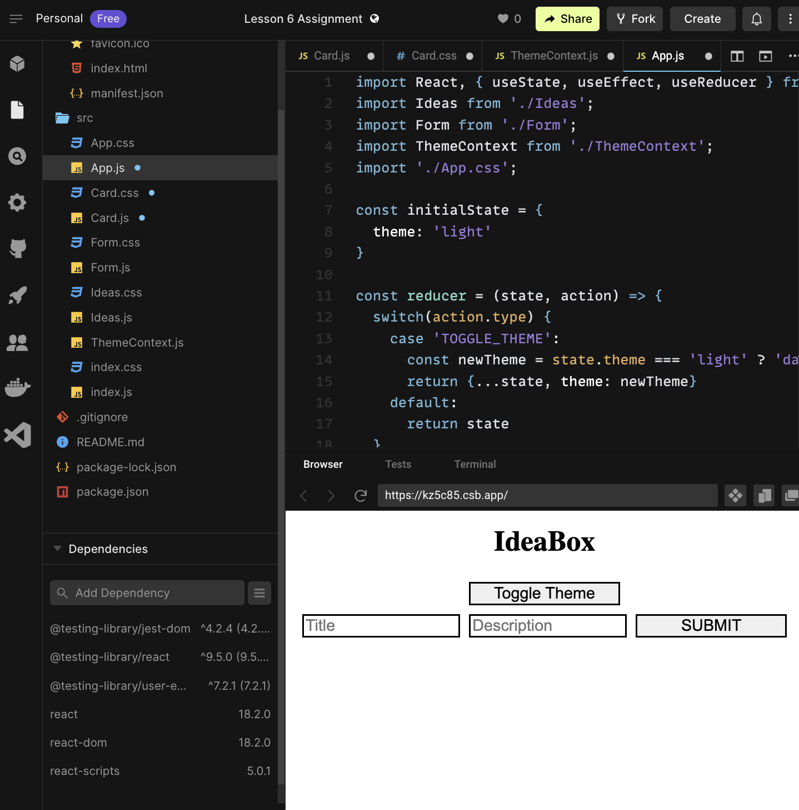

##  L06HandsOn Project

### Requirements

1. Follow guided learning
2. Create code for each hook
3. Save and copy URL to the project.
4. Paste URL on teaxt document.

**Project Setup**


[Get Starter Code Here](https://codesandbox.io/s/lesson-6-starter-code-q6n1ke?file=/package.json)

- Fork the Starter Code
- Rename it to `L06HandsOnAssignment`


**You have your new React Project ready to go to work!**. 

### Context and useContext

Although you may not have been aware of it, `Context` is something available to you already in React, it’s not something new along with hooks. Up until this point, whenever you wanted to pass something from one component to another, you’ve used props.

However, when you have to pass something across and down through many components, this can become really cumbersome. Context allows us to make data available to all child components without passing it via props.

#### An example

Imagine we wanted to pass down a theme to all of our components, either “light” or “dark”, which would change the appearance of our components. This would be an excellent use case for `Context`:

First, we need to create a context which will be available to our Component tree:

Create `src/ThemeContext.js`

```
// ThemeContext.js 

import React, { createContext } from 'react'

const ThemeContext = createContext()

export default ThemeContext
```

There isn’t much to this file, however we’ll need to import it wherever we are providing or consuming context.

Here’s how we can provide that context to everything inside of `App`, and toggle the theme based on the click of a button. 

**Note** the import of `ThemeContext`, the new call to `useState`, the `toggleTheme` function, and the updates to the return.

Update `App.js`

```
// App.js

import React, { useState, useEffect } from 'react';
import Ideas from './Ideas';
import Form from './Form';
import ThemeContext from './ThemeContext';
import './App.css';

function App() {
  const [ideas, setIdeas] = useState([])
  const [theme, setTheme] = useState('light')

  useEffect(() => {
    document.title = `Ideabox (${ideas.length})`
  })

  const addIdea = (newIdea) => {
    setIdeas([...ideas, newIdea]);
  }

  const deleteIdea = (id) => {
    const filteredIdeas = ideas.filter(idea => idea.id !== id);

    setIdeas(filteredIdeas);
  }

  const toggleTheme = () => {
    const newTheme = theme === 'light' ? 'dark' : 'light'
    setTheme(newTheme)
  }

  return(
    <ThemeContext.Provider value={theme}>
      <main className='App'>
        <h1>IdeaBox</h1>
        <button onClick={toggleTheme}>Toggle Theme</button>
        <Form addIdea={addIdea} />
        <Ideas ideas={ideas} deleteIdea={deleteIdea} />
      </main>
    </ThemeContext.Provider>
  )
}

export default App;
```

**Refresh Preview Window**


Now, we’ll need to update any file we want to access that context!

### The useContext hook 

Before hooks, we would have use of `ThemeContext.Consumer` to get the context out of the component hierarchy. However, using the new `useContext` hook, we can easily tell any component to grab the value for a particular context.

`useContext` takes one argument, the context which it should look in the tree for, and returns the value that it finds for that context.

Here, we’re getting the theme in our `Card` component, and then passing that theme as a new `className` to our `Card` div.

Open and update `Card.js`

```
// Card.js 

import React, { useContext } from 'react';
import './Card.css';
import ThemeContext from './ThemeContext'

const Card = ({ title, description, id, deleteIdea, isFavorited }) => {
  const value = useContext(ThemeContext)

  return (
    <div className={`card ${isFavorited && 'favorite'} ${value}`}>
      <h3>{title}</h3>
      <p>{description}</p>
      <button onClick={() => deleteIdea(id)}>🗑o</button>
    </div>
  )
}

export default Card;
```

***REFRESH PREVIEW BROWSER**


Finally, update the `Card.css` file to define some classes based on our “light” and “dark” themes.

```
// Card.css

.card {
  box-sizing: border-box;
  border: 3px solid black;
  padding: 10px;
}

.light {
  color: black;
  background: white
}

.dark {
  color: white;
  background: black;
}
```

***REFRESH PREVIEW BROWSER**

Now we can change the theme being passed into our `ThemeContext.Provider` back in `App.js`, and our `Card` component will know about it. Cool!!

#### When to use context

When you have some piece of data needed by a large portion of your application.

#### When not to use context

When data is only needed by one component or a component and its immediate children. As you’ve discovered, adding context is not as simple as passing a prop, so if passing a prop is the easier route, go that way. Don’t add the extra complexity unless you’re getting a clear win.

### Reducers, Actions, useReducer, and dispatch

As applications grow in complexity, our state trees can quickly get out of hand. If you have only a few pieces of `state` referenced in your top most component, it will be pretty easy to figure out how all the pieces of state are used, and how they’re updated. But what if you have 100?

One of the best patterns that emerged to address this complexity is the `Reducer`.

At it’s core, a `Reducer` is just a function responsible for managing changes to `state`. It decides how to update state based on what kinds of actions are dispatched to it.

#### Actions

An action is a regular JavaScript object which describes a change to state. Considering our previous example of theme, an action might look like this:

**EXAMPLE ONLY-DON'T CODE**
```
const ourAction = {
  type: 'TOGGLE_THEME'
}

```

An action doesn’t do anything by itself, it’s just an instruction. However, by convention, all actions must have a type key. This type key will be used by the reducer that the action is ultimately dispatched to. Other key/value pairs can optionally be included in the object as well.

#### Reducer

Just like an action, a `Reducer` is just plain old JavaScript, but it follows a very specific pattern. A `Reducer` takes a state and an action as arguments, and it returns a new state. Based on our previous action, our reducer might look like this:

**EXAMPLE ONLY-DON'T CODE**

```
// assume our state is an object with the following shape:
// {
//   theme: 'light',
// }

const ourReducer = (state, action) {
  switch(action.type) {
    case 'TOGGLE_THEME':
      const newTheme = state.theme === 'light' ? 'dark' : 'light'
      return {...state, theme: newTheme}
    default:
      return state
  }
}
```

One very important rule to follow with Reducers is to make sure they are pure. 

- This means the arguments passed into the function must remain unchanged, and the same input will always yield the same output.

#### useReducer

`useReducer` is a React hook which enables the use of this advanced pattern. 

When you call `useReducer`, you must pass the `reducer` (function) that will be used, and your initial `state`. It’s important to remember `useReducer` is generally used in place of `useState` in a component, because they’re solving the same problem.

**EXAMPLE ONLY-DON'T CODE**

```
const initialState = {
  theme: 'light',
}

const [state, dispatch] = useReducer(ourReducer, initialState)
```

From this invocation, your are given the state associated with the reducer you just created, and a new, special, function called dispatch.

#### dispatch

When we use the `useReducer` hook, the second item we are given is a function called `dispatch`. 

- The sole responsibility of `dispatch` is to take `Actions`, and send them to the `Reducer`. Dispatch is smart, so it will call the Reducer for us, with the correct state. All we need to do is pass the Action in.

**EXAMPLE ONLY-DON'T CODE**

```
const ourAction = {
  type: 'TOGGLE_THEME'
}

dispatch(ourAction)
```

### Your Turn

In the code below, we replace our `useState` for `theme` with a Reducer, and have updated the `toggleTheme` method to make use of our `dispatch method`. All the logic for how the theme should be updated now lives in the `reducer`.

```
// App.js

import React, { useState, useEffect, useReducer } from 'react';
import Ideas from './Ideas';
import Form from './Form';
import ThemeContext from './ThemeContext';
import './App.css';

const initialState = {
  theme: 'light'
}

const reducer = (state, action) => {
  switch(action.type) {
    case 'TOGGLE_THEME':
      const newTheme = state.theme === 'light' ? 'dark' : 'light'
      return {...state, theme: newTheme}
    default:
      return state
  }
}

function App() {
  const [ideas, setIdeas] = useState([])
  const [state, dispatch] = useReducer(reducer, initialState)

  useEffect(() => {
    document.title = `Ideabox (${ideas.length})`
  })

  const addIdea = (newIdea) => {
    setIdeas([...ideas, newIdea]);
  }

  const deleteIdea = (id) => {
    const filteredIdeas = ideas.filter(idea => idea.id !== id);

    setIdeas(filteredIdeas);
  }

  const toggleTheme = () => {
    const action = { type: 'TOGGLE_THEME' }
    dispatch(action)
  }

  return(
    <ThemeContext.Provider value={state.theme}>
      <main className='App'>
        <h1>IdeaBox</h1>
        <button onClick={toggleTheme}>Toggle Theme</button>
        <Form addIdea={addIdea} />
        <Ideas ideas={ideas} deleteIdea={deleteIdea} />
      </main>
    </ThemeContext.Provider>
  )
}

export default App;
```

***REFRESH PREVIEW BROWSER**



This is great, however now we’re using `useReducer` to handle the state of the theme, and `useState` for the ideas. That’s not ideal.

### Your Turn

Continue to refactor your `App.js` to make more complete use of our `reducer`. You will need to:

- Update the initial state to store an array of ideas as well

- Get rid of our call to `useState`

- Update our Reducer to handle actions which describe adding new ideas, and those which describe removing ideas

- Update the `addIdea` and `deleteIdea` methods to dispatch actions, rather than setting anything

- HINT: The logic currently sitting in `addIdea` and `deleteIde`a will need to move into your Reducer

- SECOND HINT: Your state is coming from your reducer now, so you’ll have to watch out for places when you used it in the component

**Here’s how to do it, don’t look until you try!!**

<details>
<summary>**CLICK HERE FOR SOLUTION**</summary>

```
import React, { useState, useEffect, useReducer } from 'react';
import Ideas from './Ideas';
import Form from './Form';
import ThemeContext from './ThemeContext'
import './App.css';

const initalState = {
  ideas: [],
  theme: 'dark'
}

const reducer = (state, action) => {
  switch(action.type) {
    case 'TOGGLE_THEME':
      const newTheme = state.theme === 'light' ? 'dark' : 'light'
      return {...state, theme: newTheme}
    case 'ADD_IDEA':
      return {...state, ideas: [...state.ideas, action.idea]}
    case 'REMOVE_IDEA':
      const filteredIdeas = state.ideas.filter(idea => idea.id !== action.id);
      return {...state, ideas: filteredIdeas}
    default:
      return state
  }
}

function App() {
  const [state, dispatch] = useReducer(reducer, initalState)

  useEffect(() => {
    document.title = `Ideabox (${state.ideas.length})`
  })

  const addIdea = (newIdea) => {
    const action = { type: 'ADD_IDEA', idea: newIdea }
    dispatch(action)
  }

  const deleteIdea = (id) => {
    const action = { type: 'REMOVE_IDEA', id }
    dispatch(action)
  }

  const toggleTheme = () => {
    const action = { type: 'TOGGLE_THEME' }
    dispatch(action)
  }

  return(
    <ThemeContext.Provider value={state.theme}>
      <main className='App'>
        <h1>IdeaBox</h1>
        <button onClick={toggleTheme}>Toggle Theme</button>
        <Form addIdea={addIdea} />
        <Ideas ideas={state.ideas} deleteIdea={deleteIdea} />
      </main>
    </ThemeContext.Provider>
  )
}

export default App

```
</details>

***REFRESH PREVIEW BROWSER**


#### Submission

1. Zip project folder
2. Upload folder


