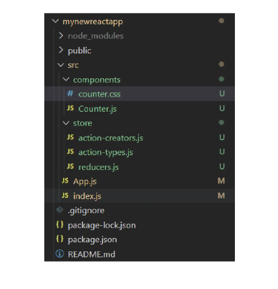

## Creating a New ReactJS Based Project and Adding Redux to it
In this project, we will make a simple `Counter`, where we will have a value we can increase or decrease using buttons.

### ### Requirements

1. Follow guided learning
2. Copy URL to completed Project
3. Put URL on text document

**[Get Starter Code Her](https://stackblitz.com/edit/react-tjywrc?file=src/App.js)e**


## Installations

- Install redux as a "Dependency"
- Install react-redux as a "Dependency"

You will require these three items to use Redux:

- `Actions`: These objects should have two properties: one indicating the sort of action to be taken, and the other specifying the changes that should be made to the app state.

- `Reducers`: These are the functions that put the actions' behavior into practice. Based on the description of the action and the description of the state change, they alter the app's state.

- `Store`: There is just one store, and it connects the actions and reducers, holding and altering the state for the entire program.

### Project Structure

Let’s arrange the Project Structure properly so it is easy to maintain. 

Inside the `src`, add two new folders:

1. `components` folder

2. `store` folder

Inside `components` we will have all our components for the application.

Inside `store` we will have three files:

1. `action-types.js`: this will contain all the possible types of actions that can take place in our application.

2. `action-creators.js`: we’ll define our action creators. As you may remember, actions are plain JavaScript objects that describe what happens in our application.

3. `reducers.js`: we define our app’s initial state and our reducer.




This is how things will look inside the project directory once we are done setting it up.

Now, let’s get started with some codes! 

Time to get your hands dirty!

### Action

`action-types.js`:

First, define the actions that can occur in `action-types.js`. In our case, we will have only two, `increase` and `decrease`.

```
//action-types.js

export const TYPE_DECREMENT = 'DECREMENT'
export const TYPE_INCREMENT = 'INCREMENT'
```

`action-creator.js`:

Now, define our action creators.

```
//action-creator.js

import { TYPE_DECREMENT, TYPE_INCREMENT } from "./action-types";

export const decrement = () => ({
    type: TYPE_DECREMENT,
});

export const increment = () => ({
    type: TYPE_INCREMENT,
});
```

As you can see, these functions are typical ones that produce objects (actions) having a `type` attribute. 

Depending on the action types in our reducers, we'll take different actions. Only the `type` attribute is required and is sufficient for our example, but actions would contain extra data in more complex applications.

### Reducers

We will be defining our reducers along with our app’s initial state here.

```
//action-creator.js

import { TYPE_DECREMENT, TYPE_INCREMENT } from "./action-types";

const initialState = {
    counter: 0,
};

export const counterReducer = (state = initialState, action) => {
    switch (action.type) {
        case TYPE_DECREMENT:
            return {
                ...state,
                counter: state.counter - 1,
            };
        case TYPE_INCREMENT:
            return {
                ...state,
                counter: state.counter + 1,
            };
        default:
            return state;
    }
};
```

Every time an action is sent in a Redux application, redux calls each reducer, sending the current state as the first parameter and the most recent action as the second parameter. 

One reducer will be used in our straightforward app. Here, we take three alternative actions based on the type of action:

1. Bring back a new state with a higher counter value.

2. New state with a lower counter value returned

3. Restore the previous state.

Simple, yes? Observe that the only language used thus far in these files is JavaScript; neither Redux nor React-Redux have been imported.

### Building the Counter Component

Let us now build the `counter` component in the` counter.j`s file.

```
//counter.js

import React from "react";
import { connect } from "react-redux";

import { increment, decrement } from "../store/action-creators";
import "./counter.css";

export const CounterComponent = ({
    counter,
    handleIncrement,
    handleDecrement,
}) => {
    return (
        <>
            Counter: {counter}
            <button onClick={handleIncrement}>+</button>
            <button onClick={handleDecrement}>-</button>
        </>
    );
};

const mapStateToProps = ({ counter }) => ({
    counter,
});

const mapDispatchToProps = {
    handleIncrement: increment,
    handleDecrement: decrement,
};

export const Counter = connect(
    mapStateToProps,
    mapDispatchToProps
)(CounterComponent);
```

Presentational component `CounterComponent` calls `handleIncrement` or `handleDecrement` on button clicks and displays the current counter.

The function `mapStateToProps` accepts the parameter `state`. We get "state.counter" using ES6 destructuring, and the object we provide translates the required piece of state to the properties of the component.

Our action creators are mapped to the props of the component using an object called `mapDispatchToProps`.


Next, we send our `CounterComponent` and the linked component to connect, which produces a new function that will accept both of them. Observe how to connect handles access to the `store` for us behind the scenes so our component doesn't have direct access to it.

### Connecting Redux and React

Now is the moment to merge `Redux` with `React`. 

Go to `src/index.js` and add the following code to its existing content:

```
//index.js

import React from "react";
import ReactDOM from "react-dom/client";

import App from "./App";

import { legacy_createStore as createStore } from "redux";
import { Provider } from "react-redux";
import { counterReducer } from "./store/reducers";

const store = createStore(
    counterReducer,
    window.__REDUX_DEVTOOLS_EXTENSION__ && window.__REDUX_DEVTOOLS_EXTENSION__()
);

const rootElement = document.getElementById("root");
const root = createRoot(rootElement);
root.render(
  <React.StrictMode>
    <App />
  </React.StrictMode>
);
```
Our app's entrance point is this. There are some adjustments we're making. By providing our reducer to the `createStore` method, we can create our `store`. The `App` component is then enclosed in a `Provider` component, making the `store` accessible to our React app.

And of course, you are free to use your own creativity in the `counter.css` file to stylize your `Counter` app using Redux in React.

## Boom!! 

That's it, we have learned how to use Redux in React using this simple Counter application as an example. 

#### Submission

1. Zip the text document with project URL
2. Upload folder