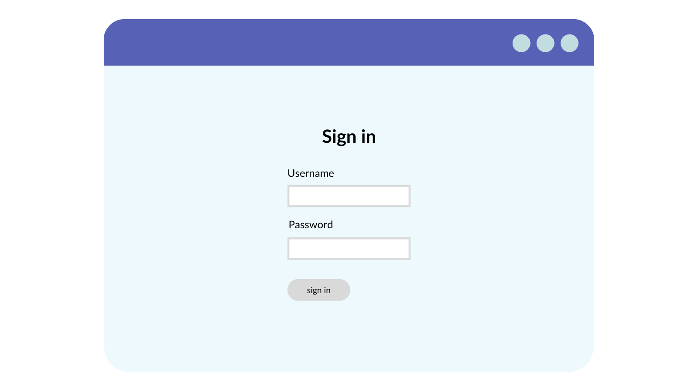

# Lesson 10 Final Project

## Project: Dinosaur Search App

In this final lesson, you'll be putting your skills together and building a Dinosaur Search App.

Over the past nine lessons, you’ve covered a lot of ground. You’ve learned about React and the part it plays as a modular, component-driven approach to building modern, responsive front ends.

Not only that but you’ve:

* Hooked it up to an API and made it more data-driven.
* Explored the common Hooks on offer, baked right into React.
* Extended the core React functionality with third-party libraries such as React Router.

You should be feeling pretty pleased with yourself for completing the projects you’ve built so far. Hopefully, by now, your React knowledge has grown to immense proportions and you’re feeling confident in your abilities to recognize the core concepts and build your own applications in this popular, powerful library.

#### Introducing the Dinosaur Search App

In this final project, you’ll be pulling together all this React knowledge and building a more comprehensive app, The Dinosaur Search App. Imagine you have a team of palaeontologists who need to be able to look up information on a range of known dinosaurs. You can build an app to help them search for dino info and save a list of their favorites to refer to later. It’ll all be powered by an API that retrieves a list of all required dino data.

Let’s jump right in and take a look at what you’ll be building

<figure><figcaption></figcaption></figure>

You have a simple navigation up top and start your journey at the main search page. From here, you can either enter a name (or part name) of a dinosaur and search on that, or hit the ‘I’m feeling lucky’ button and be taken to a page of results filled with dinos whose names start with a random letter of the alphabet.

Either option leads to the results page where you see a list of matching dinosaurs. From here you can favorite them directly, which will add them to a list in the global app state, allowing users to visit them in a separate area once they’re logged in.

If you want to find out more about a particular dinosaur, simply click the button or dino’s name and you can visit a special details page with all the information neatly laid out, including a picture of the beast in question.

Finally, you can simulate a sign-in process which will then allow a logged-in user to view their saved favorites in a convenient list.

### L10FinalProject

#### Plan out the Build

With larger, more complex apps such as this, even as a minimum viable product, where the functionality might be bare bones to begin with, it can be helpful to start by mapping out two things:

* A user journey or flow.
* Some basic wireframes.

The user journey allows you to roughly map out which parts of the app connect to each other, and how a user might navigate around an app from a given starting point. With the wireframes, you’re really aiming to loosely pin together your intended UI, placing components into groups, breaking down sections into more modular chunks, and trying to think about what will live on what page or pages — especially important in a system such as React where modularity is key!

I’ve already mocked these two things out to give you a flavor of how this could look, so take a quick peek and see how these activities can be very useful tools.

#### User Journey or Navigation Flow

Here’s an example navigation flow (or user journey) for your small dinosaur searching app.

<figure><figcaption></figcaption></figure>

You can see that your users start out by hitting the search page, which will act as your home or default landing page. This kicks off the main flow of the app which should work like this:

1. From the starting search page, users trigger a search for a dinosaur.
2. Next, they’re taken to a results page to see a list of matching dinosaurs returned from the API.
3. From here they can keep searching, or choose to view specific details of a particular dinosaur on the dino details page.
4. If they wish to sign into the app, they can visit the login page from any of the main navigation pages. They can only view the favorites page once they’ve authenticated. So, users must visit the login page and then the favorites.

Of course, once they’re logged in, you’ll enable the favorites link from the main navigation, so they can get to it any time. For the purposes of this flow diagram, you want to explicitly call out the deliberate need to visit login then favorites.

This is quite a simple diagram, but then you’re only building a relatively simple app (even though it’ll be more complex than the projects you’ve built so far). You might see lots of different versions of this sort of flow diagram in the wild, from actual flow diagrams with the correct diagram structures and types, to rough, hand-drawn sketches, and everything in between. Sometimes they might be larger in nature, encompassing more of an app all at once, or they might just show the flow for a particular area of functionality.

Whatever their approach, the aim is to give you an at-a-glance idea of how a user will flow through various distinct parts or pages within your app. They can help immensely during the planning phase of any app you’re going to build.

#### Wireframes

You’re not going to dwell on the wireframes too long, as I’m sure you’re keen to get building and put your React muscles to good use. Let’s move through the rough-and-ready wireframes for each of the pages you saw in the previous flow diagrams.

<figure><figcaption></figcaption></figure>

<figure><figcaption></figcaption></figure>

<figure><figcaption></figcaption></figure>

<figure><figcaption></figcaption></figure>

<figure><figcaption></figcaption></figure>

You can see each page’s wireframe is much like the flow diagram: quite simple and low-fi. What you’re doing here is getting down on paper (so to speak) the general idea of which parts of the UI live on which pages and roughly how they are intended to look.

Again, in the wild, you might see lots of different versions of this sort of thing, from hand-drawn sketches, physical paper models and simplistic low-fi versions, through to full-on UI mock-ups made by design teams.

Just like the user journey diagrams, the idea with wireframes is to give a general starting direction for the feel of the UI; what sort of data will be displayed on the page, in what way, and with which key interaction points (things like animations, parts of the UI that switch or change, and so on).

They help so much by providing a reference point that you can keep coming back to whilst building a component or part of an application.

### Build the App

With this being a larger, more complex app than you’ve built thus far in the course, the remaining sections in this lesson will be broken down like this:

1. In section two you’ll get all of the project scaffolding and setup done, including looking at the API you’ll be using and adding in the skeleton React Router structure.
2. In section three you’ll add in some services that will act as kindly data-ferrying middlemen, providing data to your components and updating items in your Redux store.
3. In section four you’ll flesh out the components and the UI parts of the app.
4. And finally, in section five, you’ll fire everything up and bask in your mighty coding glory as you take the Dinosaur Search App for a test flight.

Let’s dive into the next section and get cracking.

### Project Setup and Scaffolding

You put the foundations of the Dinosaur Search App in place, such as creating a new React app and exploring the supporting API

You may be unsurprised to learn that dinosaurs are quite old and that there isn’t much data around for a fair few of them. What is a little surprising however, is that there are zero live APIs out in the wild that deal with dinosaur-exclusive data!

But fear not, because I have got you covered. In the accompanying course material there is [starter project code](https://github.com/Dev-Doctor-Vicki/api-server-starter) for this project that includes a `client` and a `server` folder. You’ll be building everything you have planned in the `client` folder, but the `server` folder houses a fully-functional Node-based API that will provide you with all you need to serve your app.

* If you’re interested in learning more about this Node server starter-kit, then here is a [helpful article](https://robkendal.co.uk/blog/how-to-build-a-restful-node-js-api-server-using-json-files) on this very subject.

You’re going to quickly spin up the API `server` and take a brief look at the queries you can make, and the sort of data you’ll get back, as well as how to start it.

#### Open and Run the Starter Project

Here’s where you grab the project files for this course, if you haven’t already done so. You’ll need them for this last project as they include the API server, which you won't be building from scratch!

Click below to download the Starter Code.

[Starter Code](https://github.com/woz-u/SWD-FrontEndFrameworks-React-Updates/blob/main/lesson-10-%20React-Final-Project/assets/start)

After you download the project files, I recommend creating a new folder on your local machine to house them. For example I created the following empty folder on my local machine, called /code/demos/dino-search-app.

Copy the contents of `/lesson-10/start/` into your new local folder. When you’re finished you should have a folder structure that looks like this:

```
/dino-search-app

--/client

--/server
```

Open the project in VS Code (or your favorite editor) and take a look at the API files.

#### Queries and Routing

In the `/data` folder you have `dinos.json` file. If you take a look at this file, you’ll find a huge list of more than 50 objects that each represent a collection of information points for a particular dinosaur. Each has a unique id value, name, location, image filename, and some other relevant info.

Open the `/server.js` file and you’ll see the bare minimum required to get an ExpressJS-powered Node server up and running. This file creates the server, `app` and plugs in the `/routes/routes.js` file, which serves various API end points.

The other thing to note here is that you explicitly define a static `/images` route that will allow you to serve images directly from the API as image data, rather than a set of JSON results, as with the dinosaur data. In the frontend client app we can call this endpoint `/images/image_name.jpg` and simulate grabbing an image from a CDN, rather than having to house the dinosaur images locally in your frontend project where they don’t really belong.

If you look in the `/routes` folder, you have a main `routes.js` file that collects the other two files in this folder (`dinos.js` and `login.js` ), and plugs them into the Express JS server you just outlined.

#### login.js

The `login.js` file serves a single route, `/api/login`, and is fairly dumb in its operation. If there is both a `username` and a `password` value supplied, it will generate a dummy JWT token and return it to the caller. If neither is supplied, then it returns a `401` error to indicate the user is unauthorized. Of course, this is not in the least bit secure or hooked to up an actual authentication system, but it will serve the purpose of simulating one for your frontend client app, which doesn’t need to care about the backend implementation anyway, just what’s returned from the API.

#### dinos.js

The `dinos.js` file is where the API peovides for all the dinosaur-related endpoints. It handles:

* `/api/dinos` for fetching all dinosaur information.
* `/api/dinos/search/:term` for fetching a filtered list of dino information based on whether the `:term` parameter is a single character or a name of some sort.
* `/api/dinos/:id` for grabbing a single dinosaur object.

You don’t need to go into go into great detail about the inner workings of the API setup here (you can refer to [the article](https://robkendal.co.uk/blog/how-to-build-a-restful-node-js-api-server-using-json-files) on this exact thing if you’re curious, but the basic operation is that each API endpoint uses the Node `fs` function to read the `dinos.json` file. Depending on the endpoint called, the resulting JSON data is filtered and formatted and then returned to the caller as JSON data.

#### Run the API

Before you plough on with the front-facing client app, quickly spin up the API server and check that it’s working OK.

In your terminal, navigate to the root of the `/server` folder. If this is the first time you’re running it, you’ll need to install the dependencies with the following command

`npm install`

Once that’s finished, run the start command:

`npm start`

Nothing exciting will happen at this point, but you should see a message in the terminal saying ‘listening on port 4000…’ which means the API server is running.

If you open a browser and navigate to [http://localhost:4000](http://localhost:4000/), you will see a white screen with the message ‘welcome to the development dinosaur api-server’ displayed. If you navigate to the main dinosaur route, [http://localhost:4000/api/dinos](http://localhost:4000/api/dinos), you’ll see a more interesting result — the list of all dinosaur information objects returned to the browser as JSON data.

### Project SetUp

Now that you have a good idea of what’s what with the API server part of the project, you need to focus on building the frontend client app in your beloved React. Once again you’ll be calling on the Create React App project to get off to a best-practice flying start.

#### Install a New Create React App Project

Since you’ve already have a starter project and a folder, `/client`, where you want your frontend files to live, using the default Create React App project command can be a little more cumbersome, but let’s walk through it and see if we make it out the other side unscathed.

Open a terminal window to the dinosaur project folder and leave it at the project root (the one at the same level as the `/client` and `/server` folders). Now run the familiar command:

```
npm create react-app dino-search-app
```

Once it’s finished, open the folder on your machine and cut-and-paste all of the contents into the `/client` folder. Once this is done, delete the dino-search-app folder, as you don’t need it.

#### Project Clean Up

Now that you have a shiny new Create React App instance installed and ready to go, let’s move through the same parts as in previous lessons, and clean up the default files a little.

* Open `index.js`, and remove the reference to `import ‘./index.css'`.
* Delete the `/src/index.css` and `/src/App.css` files.
* Open the main `App.js` file and empty it so you can add your demo-specific code later on.

#### Add Dependencies

You’ll need to add a few dependencies to your app:

* `axios` - your old friend axios will help talk to your dino API and fetch the important fossil data for.
* `bulma` - no surprises here, Bulma will add nice styles and look and feel to the UI.
* `react-router-dom` - again you’ll be leaning on this package to route your users between pages and areas of the app.
* `@fortawesome/fontawesome`-free - this is a new one, but the popular font-icon library provides support to Bulma, allowing you to display some nice icons along with the dinosaur information.
* `node-sass` - you’ve used node-sass previously to compile your `.scss` files into the browser-useable `.css` files.

Let’s work through them, adding them all to the project via the familiar `npm add [dependency name]` syntax you know and love. I’m adding them one by one here for clarity and to ensure there’s no mistakes that could be caused by misspellings or typos.

* `npm add axios`
* `npm add bulma`
* `npm add react-router-dom`
* `npm add @fontawesome/fontawesome-free`
* `npm add node-sass`

#### Wire up the Proxy

This is going to be an unfamiliar part of the process you’ve not covered yet. However, the Create React App scripts offer a special property, `proxy` that you can add to your `package.json` file.

Open the `package.json` file, and add the following line at the end of the file:

```
"proxy": "http://localhost:4000"
```

Essentially the proxy property here allows you to proxy (i.e. an intermediary for requests) requests between front and back-end apps using the same port. It’s something that can happen more frequently in local development scenarios.

Your front-end app and the API you’re calling aren’t running on the same port, but this does have an added benefit of not having to deal with irksome [CORs errors](https://en.wikipedia.org/wiki/Cross-origin\_resource\_sharing) and blockages, especially when you don’t have any security concerns at the moment since you’re running everything on your local, sealed off machine. Also, it means you can avoid writing longer API URLs because the value you add here is automatically prepended to requests that aren’t text/HTML in nature — e.g. API calls.

You can read more about the proxy function in the [Create React App documentation](https://create-react-app.dev/docs/proxying-api-requests-in-development/).

#### Add the Dino Logo

You will use a little cartoon dinosaur mascot as your logo in a few places throughout your app, namely this little guy:

<figure><figcaption></figcaption></figure>

You can grab him from the finished course files or download him from this lesson text. Simply right-click and save him somewhere on your desktop.

Make sure to name him `cartoon-dino.png` and copy him into the `/client/public/` folder in your project.

### Files and Foolders Creation

With all your dependencies added and your proxy set up, create all the files and folders you need for the project and build them out.

```
root/
├─ server/
├─ client/
│  ├─ services/
│  │  ├─ api.service.js
│  │  ├─ auth.service.js
│  │  ├─ dino.service.js
│  ├─ redux/
│  │  ├─ authReducer.js
│  │  ├─ dinoReducer.js
│  │  ├─ initialState.js
│  │  ├─ reducers.js
│  ├─ components/
│  │  ├─ DinoBrowse.jsx
│  │  ├─ DinoCard.jsx
│  │  ├─ DinoDetails.jsx
│  │  ├─ DinoSearch.jsx
│  │  ├─ Favourites.jsx
│  │  ├─ Layout.jsx
│  │  ├─ LoginForm.jsx
│  │  ├─ Navigation.jsx
│  ├─ assets/
│  │  ├─ styles.scss
│  ├─ index.js
│  ├─ App.js
```

#### index.js

Included out of the box; you only need to bring in a Redux provider component here and wrap it around your app’s starting point.

#### App.js

Another default component; but you’ll be building this out as a centralized routing station of sorts to handle navigation route matching to the correct components via the React Router library.

#### services/api.service.js

The first of your service-layer handlers that you’re introducing to act as a clean middleman that will handle API requests for other parts of the app, returning necessary data.

#### services/auth.service.js

The second data-handling service helper; the auth service will handle any user sign-in requests, calling the API and any Redux interactions you need as part of it. It’ll also offer two custom Hooks you’ll explore in more detail as you build out the code.

#### services/dino.service.js

The final service helper will handle requests to the API for dinosaur-related data and update any relevant Redux calls.

#### redux/authReducer.js

Just as in the previous lesson on Redux, the `authReducer` will deal with updates to the auth-specific slice of global app state.

#### redux/dinoReducer.js

Another reducer that will deal with dinosaur information updates to global state.

#### redux/initialState.js

Just like you had in the Redux lesson, `initialState` offers a good blank slate starting point for your app’s initial global state.

#### redux/reducers.js

This will be almost identical to the same file from the previous lesson. Its function is to pull together the separate reducers and combine them all, wrapping everything up in an exported `Provider` component.

#### assets/styles.scss

Nothing flashy here; just a `.scss` file that pulls in the FontAwesome and Bulma styles and adds a couple of helpful styles for some of the components you’ll be building later on.

#### components/DinoBrowse.jsx

When built, this component will render a list of dinosaur information card elements and allow the user to search by name or by alphabetical letter category.

#### components/DinoCard.jsx

A semi-presentational component that will display relevant dinosaur information in a tidy and clear manner and allow users to favorite a dinosaur.

#### components/DinoDetails.jsx

This will be a much larger component that handles retrieving data for a specific individual dinosaur and then displaying it, again allowing the user to favorite (or unfavorite) the dino in question should they choose.

#### components/DinoSearch.jsx

A relatively simple component with some scant logic that displays a search box and a couple of buttons to the user to allow them to search for dinosaurs by name. This will also represent the home page for your app.

#### components/Favorites.jsx

The `Favorites` component will display a list of dinosaurs in a similar fashion to the `DinoBrowse` component. The difference here is that it will retrieve the list of dinos to view from the favorited information held in our global Redux store.

#### components/Layout.jsx

With this component you’re effectively adding a styled structure around the other child components. It’ll contain app-wide UI that includes things like a header and navigation, as well as some global spacing elements. It’s also purely presentational.

#### components/LoginForm.jsx

Perhaps unsurprisingly, this is what you’ll show users when they wish to sign into the app. It’ll house a simple username/password form and pass these details on to the API via the service handlers.

#### components/Navigation.jsx

Another semi-presentational component that will provide an app-wide navigation element containing various React Router Link components that ferry your user around the child pages and areas within your app.

Now you’re clear on what you’re building, and created the bare bones of the files, let’s work through them and flesh them out!

### Styles.scss

Open the `/assets/styles.scss` and copy in the following styles:

✍️

<details>

<summary>src/assets/styles.scss</summary>


</details>

The import statement at the top of the file brings the Bulma CSS framework styles into the project. The rest of the file should be fairly clear; you don’t have any tricky styles or crazy CSS wizardry here. The remaining styles are helpful to handle the oddly-shaped images you have for your dinosaurs, setting background sizes and such. You also remove some unsightly underlines around the favorite icons you’ll add in later on.

#### index.js

There’s barely any work to do in the `index.js` file. You just need to bring in the `StoreProvider` you’ll create shortly and wrap it around the `App` component.

Open the file and import the `StoreProvider` at the top of the file.

✍️

<details>

<summary>src/index.js</summary>


</details>

Next, just wrap this component around the `App` component as you did in the last lesson, and save the file.

That’s us all done here for now. Let’s move on to the last edit in this part.

### App.js and Routing with React Router

Your `App` component is a routing office of sorts. It’s not going to house any logic, but it will contain the main navigation routing paths and their corresponding components that handle them.

#### Add the Imports

Open the empty `App.js` file and let’s bring in the imports:

✍️

<details>

<summary>src/App.js</summary>


</details>

You’re bringing in many tools from the react-router-dom toolbox here to help with routing, just as you did in the React Router lesson. Next you have your styles file to help applying Bulma to your app. Finally, you’re bringing in all the components you’ll need to handle the various routing scenarios as per your user flow diagram.

Don’t worry that you haven’t built these files out yet. You’ll be doing that as we move along. You can bring them onboard here because you won’t need to edit the `App` component any further, and at the moment, none of the components will need any additional logic to be carried out here either.

#### Add the Component Body

Now, let’s add in the body of the component and set up the route handling:

✍️

<details>

<summary>src/App.js</summary>


</details>

As a general rule, you should wrap your app in the `<Router />` component (or each major part if the app is large enough to justify this approach), which is what you’re doing here. By doing this, you allow all the child parts and components of your app access to the React Router system.

For example, this is useful for how you’re using the `<Layout />` component here, which is added just under the `<Router />` component. When you build it out later on, it will contain a navigation element that uses some other Hooks and features of the React Router system. To make use of these, you need to provide access to React Router’s main component higher up in the component tree, just like you’re doing here.

After this, you’ll recognize the `Switch` component that you’ve used. The `Switch` component is designed to match and render routes exclusively. In practice, it means you have more precise control over what is rendered for each route. You have very distinct route-handling needs here for each separate page in your dino-searching app. `Switch` helps make better matches against each navigation route a user visits.

You can read more about `Switch` on the [React Router docs](https://reactrouter.com/web/api/Switch).

Inside of the `Switch` component is the meat and potatoes of your route-matching system. You can see that you have a number of mostly self-explanatory routes that will render the components you imported earlier, depending on the route they chose.

You can recognize the route parameter format from the earlier lesson on routing here, too. Routes like `/browse/:name` will match URLs such as `/browse/an-interesting-name` or `/browse/123`. Notice too, how you are listing route paths in order of most-specific to least-specific. The `Switch` component works in this way too, so you’re mirroring that. You’re not making much use of this system here by supplying different components for the same route, but which features a parameter, but you may want to in other apps, so it’s useful to see an ideal approach to handling that scenario.

**NOTICE!**

Notice in this app you decided to just hard-code the route paths as strings. In the lesson on routing, you opted to pull your routes from a `routes.js` file and dynamically loop through them. To keep the overhead a little lower in this more complex dino app, you’ve chosen the direct paths-as-a-string approach, but you just as easily use whatever method you like here. As long as each `Route` component has a path attribute to match against a URL and a `component` attribute to know what to render when the path matches, the routing system is happy.

So, each `Route` component here matches a path and renders the correct component to handle it. You have one final, non-explicit `Route`, which will be rendered if nothing else matches. For example, if a user navigates to `/apples`, you don’t have a matching route for that, and this catch-all block of JSX will be rendered. It’s just a simple `h1` element explaining the classic ‘404 - Page not found’ message and giving users a way out, back to the safety of the home page.

**Completed component**

With everything finished in the App component, it should look like this:

✍️

<details>

<summary>src/App.js</summary>


</details>

#### Next Steps

That’s all there is to the `App` component. It’s a navigation route-handling train station, passing the user the correct component for their selected route. In the next part, you’ll work through the services and Redux files to put the data-handling underpinnings in place that will support your UI components.

### Build the Services

Now focus on building the data-handling services and core Redux management system for the Dinosaur Search App.

#### Build the Services and Core Structure

You’re going to add something a little different in this final project, the concept of services. If you’ve been developing for a little while, the idea of a service layer won’t be anything surprising or new to you, but for the rest of you, introducing some data-handling services will give some separation between different layers of your app.

Ideally, the frontend UI should just concern itself with asking for data, receiving it, and then displaying it to the user, allowing them to interact with it. It shouldn’t know (or care) where this data comes from, or how.

That’s the idea behind creating your various `[name].service.js` files that you’re going to build in this section.

However, for now let’s start with implementing a Redux system using the `useReducer` Hook and the Context mechanism, as this whole process should be fresh in your mind from the previous lesson.

#### initialState.js

You’ll begin by opening the `initialState.js` file in the `/redux` folder. Add the following `initialState` object in its entirety:

✍️

<details>

<summary>src/redux/initialState.js</summary>


</details>

You might remember that this offers a good at-a-glance starting point for the sort of structure you want your app’s state to take. You’ll plug this file into your reducers to effect change upon it as each reducer function is called.

At the moment, however, you can see that you have two slices of state: `auth` and `dinos`. Each has a loading flag set on it (which you can use to toggle some sort of loading UI in the components) and you can see that the `dinos` slice has a favorites array where you’ll keep track of your favorite dinosaur id values.

Save the file and let’s move on.

#### authReducer.js

As you may expect, the `authReducer.js` file will handle state updates that relate to the `auth` slice that you’ve just seen. Specifically you’re interested in a few state changes:

* Trigging a loading status change upon signing a user in.
* Updating the user object when you’ve successfully finished signing in.
* Performing a state reset when the user signs out.

Start by creating a set of actions:

✍️

<details>

<summary>src/redux/authReducer.js</summary>


</details>

The `actions` variable is just a plain JavaScript object that houses some hard-coded action strings. Next, it’s time for the physical reducer code:

✍️

<details>

<summary>src/redux/authReducer.js</summary>


</details>

You can see you have three different `switch` cases to handle the three scenarios outlined earlier. Each one returns a new copy of the `state` object, only changing those parts that it needs to.

The only time you’re concerned with using the `action` argument passed to the reducer is when the user has successfully signed in and you get a user object back — you might remember this from the previous lesson where you explored the API.

**The Complete File**

The file in its entirety now looks like this:

✍️

<details>

<summary>src/redux/authReducer.js</summary>


</details>

### dinoReducer.js

The `dinoReducer.js` file is going to look very familiar to the `authReducer` file in its approach. This is something highlighted in the previous lesson on Redux, where things might look a little alien and complex to begin with. Once you’ve built a Redux system, extra additions to it start to look familiar.

Let’s define this reducer’s actions:

✍️

<details>

<summary>src/redux/dinoReducer.js</summary>


</details>

This time you have four actions, two for fetching dinosaurs and two to handle the favoriting and unfavoriting of a particular dinosaur.

Let’s add in the reducer body:

✍️

<details>

<summary>src/redux/dinoReducer.js</summary>


</details>

The first two `switch` cases essentially just alternate a `loading` property from `true` to `false`, and vice versa. I don’t think it hurts to have this `loading` state change happen in two separate reducer cases for your learning purposes, but you absolutely could create a `TOGGLE_LOADING_STATUS` action, and just flip the `loading` boolean to its opposite state in one shot.

Further down where you have the favorite-handling parts, there is a little more logic, but nothing too complicated. In the first, when the user favorites a dinosaur, you return a copy of `state` with the `action.payload` value (which will be an `id` string) tacked onto the end of the favourites array.

Conversely, when a user unfavorites a dinosaur you need to perform a slightly bigger code dance to filter the current favorites in `state`; remove the `id` value that matches the `action.payload` value, and then set the favourites property in `state` to this new array.

**The Complete File**

The completed reducer file should look like this:

✍️

<details>

<summary>src/redux/dinoReducer.js</summary>


</details>

### reducers.js

Open the `reducers.js` file and pull everything together to wire up the various parts of your Redux system.

Here’s the code that’s going to power things:

✍️

<details>

<summary>src/redux/reducers.js</summary>


</details>

This might look like a lot to drop in all in one go, unexplained, but you’re not going to dwell on the details here. The keen-eyed among you will notice that this is almost identical to the `reducers.js` file from the last lesson on Redux. The only difference is that this time you have two reducers to import, namely `auth` and `dinos`.

You import those reducers and pass them to the `combineReducers` function, which will smush them together and handle different updates to different slices of `state`, while you just worry about calling a single dispatch function to do the job.

Save this file. Now it’s time for some services.

### Services

As explained at the beginning of the lesson, building a service layer gives a greater degree of separation between the different parts of the app. By building out some service handlers, you can remove the responsibility of talking to the API from the UI components. They don’t need to concern themselves with talking to the Redux store either.

With service handlers in place, they just need to ask a particular service for data, receive it, and then process it accordingly. What’s also nice about this approach is that later down the line, you could change the service handler to use a JSON file instead of an API, or talk to a database directly, and the components calling this service would never need to know about it.

Each service will manage a particular aspect of data interaction, such as authentication and dealing with the API. Each one will talk to the API, supply and request information as appropriate, and call out to the Redux store to dispatch any updates to your app’s global state system.

#### api.service.js

Start with the `api.service.js` file. This will be a service to service other services (try saying that three times fast!). Essentially, the API service will be the direct link to your API. It’ll handle any and all API calls, formatting incoming data and returning any response from the API to the caller.

Open it and let’s fill it out, starting with a bare scaffold:

✍️

<details>

<summary>api.services.js</summary>


</details>

You’re pulling in `axios` to help with physical API calls. Next you have a `baseUrl` variable which is a simple string, `/api`. At the moment, all of your API calls start with this string path, but you don’t want to have to litter each function you create with it, and if it changes that means more work. You can stash it in a variable here for reference later.

Next, the `getUrl` function is a simple, one-line, arrow function that uses JavaScript's string templating syntax to return a resulting API endpoint that begins with `/api` and appends whatever URL was passed to it as a parameter.

Finally, you have a barebones JavaScript class, `ApiService`, that contains two methods, `get()` and `post()`, which will handle `GET` and `POST` calls to the API respectively.

#### Add the axios Calls

Let’s flesh out the two class methods:

✍️

<details>

<summary>src/services/api.service.js</summary>


</details>

In each method, you call an axios function, `get()` for `get()`, and `post()` for `post()`. You pass some additional data to the `post()` function, but each case returns the asynchronous promise to the caller.

**The Complete File**

The completed API service file should now look like this:

✍️

<details>

<summary>src/services/api.service.js</summary>


</details>

With this first service complete, I must admit it doesn’t look very exciting at the moment, nor does it do anything particularly exciting yet. However, it gives a great starting point to extend the interaction with the API. Even if it’s doing little more than calling the API and returning the response to the caller, you could add logging in here, intercept the request or response, inject authentication bearer tokens, or a myriad of other things if you so choose.

The important take-away here is that you’ve created a helper service whose responsibility is to deal directly with the API.

#### auth.service.js

The Auth service will provide two super-useful custom Hooks when you’re finished:

1. `useAuth` which will give access to the loading state of the authentication `state`, and two functions to log in and log out.
2. `withAuthenticationRequired` which will be a wrapper function that will check the authenticated status of your user, and either return them the component they want if they’re authenticated, or redirect them to the `/login` path if they’re not.

Let’s start with the imports:

✍️

<details>

<summary>src/services/auth.service.js</summary>


</details>

You have the `useContext` Hook direct from React, and then the `Redirect` component from React Router. Next, grab your auth-related `actions` from the `authReducer` file, as well as the `StoreContext` and `createAction` helper, so you can both access any relevant state items and dispatch updates as necessary.

Finally, you’re bringing in the `ApiService` that you created moments ago, as you’ll need to send some requests out to the API when signing your users in and out.

#### The useAuth Hook

This is going to be your very first custom Hook! It might sound a little daunting, but essentially a Hook is a section of code that provides some access to deeper parts of the system. Default Hooks, such as React’s `useState`, are really high-level functions of sorts that give you access to React’s built-in component state-management system, returning two variables when you call it.

Let’s start with the scaffold function:

✍️

```
// custom useAuth Hook 
export const useAuth = () => {
    
    return {        
    
    };
};
```

With `useAuth`, you really want to provide components with access to check if a user is authenticated, if there are any operations in a loading state, and a couple of functions to log a user in and out.

Let’s create the variables first and then move onto the functions:

**src/services/auth.service.js**

✍️

```
export const useAuth = () => {
    const [state, dispatch] = useContext(StoreContext);
```

Just like you did in the previous lesson, you’re calling the `useContext` Hook here with the imported `StoreContext` object. This will give access to your app’s `state` and the `dispatch()` function to make updates to said state.

Next, let’s create a function to allow your users to log in:

✍️

<details>

<summary>src/services/auth.service.js</summary>


</details>

Starting at the top, you created a `login()` function asynchronous and accepts a `username` and `password` as parameters. You define a response object and set it to `null`. Next, change your `state` `loading` boolean to `true`, so you call the `dispatch()` function from your context, passing in the relevant action using your helpful `createAction` function.

With that done, now call upon your `ApiService`, calling its `post()` function, ensuring you use the `await` keyword to tell the JS engine to hold on a moment, and wait for the response from the service.

Pass in the `/login` URL and the `username` and `password` arguments this function received. You’re tacking on the `catch()` function to the promise that you get back ,just in case something goes wrong and you can ensure you handle the response. If this happens, log it out to the console and update your currently `null response` object, assigning to it a property, error`, with a value of`true`. This will then be returned to the` loginResponse\` variable.

Next up, you do a quick check of the `loginResponse` variable, to see if it has the error property. If it does, then just return it right away. If not, and everything has succeeded, then call up the `dispatch()` function once more to update the login status of the user in state, passing along the `loginResponse.data` object from the API call, which will be a user object consisting of a token and authenticated status values.

Finally, return the same `loginResponse.data` to the caller, just in case they want to do anything useful with this information.

That’s the largest function done in the `useAuth` Hook. The next, `logout()`, is far simpler, so let’s define that now:

**src/services/auth.service.js**

✍️

```
    const logout = () => {
        dispatch(createAction(actions.SIGN_OUT_USER, null));
    }
```

In an actual app with a proper authentication system, there might be a need to call an API endpoint to flush any caches, clear tokens or sessions at the server level and so on. However, you can simply clear out the user property in state by calling the `dispatch()`, function passing it the `SIGN_OUT_USER` action, and your work is done.

The last thing to do is to return an object that provides these various methods to anyone wanting to consume and use them. Let’s define that now:

✍️

<details>

<summary>src/services/auth.service.js</summary>


</details>

You passed `login` and `logout` directly, and added two other properties; `isLoading` and `isAuthenticated` . The `isLoading` property is just the direct value of the `loading` property from the `auth` slice of `state`. With `isAuthenticated`, you're doing a double exclamation shortcut assignment operator to cast the value of `state.auth.user` to a boolean. If it’s a falsy value, such as `null` or undefined, then it’ll return `false`.

#### The withAuthenticationRequired

The `withAuthenticationRequired` function is a higher order component that accepts a function (which will be a component that you’d like to have rendered) and some options, and returns a function (which will be another component) as a result. Its main purpose is to work out whether a user is authenticated, returning the intended component and props if they are, or redirecting the user to the login screen if they’re not. It’s useful because there will be certain routes that you don’t want your visitors to view without being authenticated first.

For example, you don’t want unauthenticated users to view the `/favorites` route. However, while the navigation component that uou’re going to build later on will only render links to restricted routes if a user is authenticated, it won’t stop anyone from just putting `/favouites` into the address bar. So, you need a better means to handle sneaky or accidental routing.

Let’s start with the outline:

✍️

```
const withAuthenticationRequired = (Component, options) => {
    return function WithAuthenticationRequired(props) {

    };
};
```

Later on when you flesh out the components, you’ll see this in action, but for now trust that you’ll call this component function as `withAuthenticationRequired()`, passing it a component that you want to ultimately render. What gets returned immediately is another function component named the same, but capitalised as `WithAuthenticationRequired`.

Let’s add some variables into this returned function:

✍️

<details>

<summary>src/services/auth.service.js</summary>


</details>

Having just defined the `useAuth` Hook, you’re using it here to grab the `isAuthenticated` variable that it exports. You’ll then destructure the incoming options argument and extract the location value from it.

Next up, the main logic:

✍️

<details>

<summary>src/services/auth.service.js</summary>


</details>

First, check whether the current user is authenticated. If not, then immediately return the `Redirect` component that you imported from the React Router library, sending the user to the `/login` page.

If everything’s in order, however, then we can safely return whichever component was passed in as the `Component` argument, making sure to also pass along the supplied props to it.

With this higher-order component finished, you can use it wherever you like, to wrap around regular components that you want checking for user authentication before rendering something a regular user shouldn’t see.

**The Complete File**

The completed Auth service file should now look like this:

✍️

<details>

<summary>src/services/auth.service.js</summary>


</details>

### dino.service.js

The last file to edit in this part is `dino.service.js` . The primary purpose of this service is to provide some functions to add and remove favorite dinosaurs, and load a list of dinosaurs or individual dino details.

Open the file and let’s start with the imports which will look very similar to the `auth.service.js` ones:

✍️

<details>

<summary>src/services/dino.service.js</summary>


</details>

There you go. The only real difference is you're using the Redux actions from the `dinoReducer` instead of the `authReducer`.

Next up, let’s define the skeleton export and main logic in this file; the `useDinos` Hook:

✍️

<details>

<summary>src/services/dino.service.js</summary>


</details>

What you have here is a slightly different approach to creating a skeleton class, function, or other contained piece of logic. You created a named export, `useDinos`, which will be an arrow function, and you immediately grabbed the `state` and `dispatch` variables from the `useContext` Hook you imported.

Next, you outlined all the empty functions that you want to return from this custom Hook (notice how some of them carry the `async` tag where you’re going to be dealing with an API operation). This is just a different way to approach building out your files. I like to scaffold components or Hooks or services like this in my own code, especially when I know what logic I want to build ahead of time. It can prevent some silly mistakes early on, such as missing semicolons or braces.

Finally, you have a similar return object as you had in the `Auth` service. You’re providing a similar `isLoading` property, and then an array of favorite dinosaur `id` values, `favoriteDinoIds`, both coming directly from your app `state`. After these you provide the skeleton functions you created using the same-name object property shorthand.

#### addFavoriteDino and removeFavoriteDino Functions

Let’s flesh out those empty functions, starting with the add and remove from favorites:

✍️

<details>

<summary>src/services/dino.service.js</summary>


</details>

You’ll cover both of these functions in one go because they’re almost identical, being two sides of the same coin. They’re both calling the `dispatch()` function to trigger a particular change in `state` to the list of favorite dinosaur `id` values — the first adding one, the second removing one.

#### loadDinos Function

Now let’s fill out the `loadDinos` function:

✍️

<details>

<summary>src/services/dino.service.js</summary>


</details>

At first glance, this looks very similar to the login function in the `Auth` service. That’s because the logic for calling the API is kinda similar across most of the functions that need to call it; there’s a common process that they all share:

1. Work out which endpoint to call
2. Prepare some data to send to the API
3. Call the API, handling some errors
4. Check the response for errors
5. Return either an error object or the intended response with requested data
6. Do some Redux things along the way

In this respect, the `loadDinos` function is no different. You start by checking the `searchTerm` value that’s passed in to the function. Notice how you set it to `null` by default, as this is easier to check for if a value isn’t supplied. People will only search for a dinosaur name, part of a name, or nothing at all, so `searchTerm` here will either be empty or a string. Use the ternary `if` statement to check its value, and set the appropriate endpoint to call from the API. As you saw when you looked at the API, `/dinos` will return all the dinosaurs, whereas `/dinos/search/:term` will filter the available dinosaur data based on the `:term` parameter that’s passed in.

Next up, call the Redux `dispatch()` function to kick off the loading process so your components can render the appropriate UI.

From here, call the API via the `ApiService` you imported. Check for errors, returning early if you find any. If everything went well, then issue a final `dispatch()` call to flip the loading boolean back to `false`, and return the data from the response (in this case it will be an array of dinosaur information objects).

#### loadSingleDino function

Of course, you don’t always want to load a bunch of dinosaurs. Sometimes, you only need to grab data about one specific dinosaur, such as when you’re viewing the details page you saw earlier in your user flow diagrams. This is where the `loadSingleDino` function comes in.

Let’s fill in the final blanks for the logic in this function:

✍️

<details>

<summary>src/services/dino.service.js</summary>


</details>

You can see that you’re looking at a very similar body of logic to the `loadDinos` function. Dispatch a `state` update to change the loading status, then call the API endpoint `/dinos/:id`, passing along the `id` argument this function receives.

Once you have a response back from the API, check for errors (returning early if necessary), update the loading status again via a final `dispatch()` call, and then return the data from the response object, which will represent a single dinosaur information object.

**The Complete File**

After all your hard work, the completed Dino service file should now look like this:

✍️

<details>

<summary>src/services/dino.service.js</summary>


</details>

### Build the Component Files

You’ve covered a lot of ground, putting both your app’s Redux system in place and building some helpful service-layer helpers. In the next section, you’ll be finalizing the code in your component files and running the app to search for interesting dinosaur facts.

#### Flesh out the Components

So here you are: the final coding lesson in the course and the one that will make all the magic happen in your Dinosaur Search App: the components.

You’re going to work through the components you defined right at the start of the lesson, and craft your UI, which will be powered by the hard work you completed in the last section.

Let’s start with the `Layout.jsx` component.

#### Layout.jsx

The `Layout` component is simple and presentational in nature. You used it in the `App` component to wrap a set of child components in some common styles and structure including things like a header and navigation. Now’s the time to put those common elements in place, and you’re going to define the entire file here in one go since it’s quite small:

✍️

<details>

<summary>src/components/Layout.jsx</summary>


</details>

Pull in the `Navigation` component, (which you’ll build out next) and then define and export the `Layout` component. You’re destructuring the incoming props argument passed to the component, pulling out the children value. The children property is one of a few default properties on each props object passed to a given component. A lot of components have children, but you don’t always make use of this children property unless you want to simply pass them along and render them as intended (but unaffected), like the `Layout` component is doing here.

Wrap the `Navigation` component in a `<header/>` element, and then add a semantic `<section/>` element and child container with some scant Bulma classes on them to just give some padding and other spacing.

Because this component will be applied to any route that’s rendered by `App`, you can ensure that each separate ‘`page`’ in your app will share the same foundational structure, header, and spacing base styles.

### Navigation.jsx

The `Navigation` component is almost entirely presentational in nature in that it has minimal logic in place, and even then, what it does have is a series of toggles for displaying one thing or another depending on the boolean value of some variable.

#### imports Section

Let’s start with the imports:

**src/redux/initialState.js**

✍️

```
import React from 'react';
import { Link } from 'react-router-dom';

// Services
import { useAuth } from '../services/auth.service';
```

You need the `Link` component from React Router so that you can navigate your users around the app when they click on a menu item, so pull that in. You’re also going to be checking if a user is authenticated or not, using your custom Hook, `useAuth` so you’ll bring that in too.

Now for the skeleton component body and default export:

✍️

<details>

<summary>src/redux/initialState.js</summary>


</details>

After calling the `useAuth()` Hook here, you can pull out just the `isAuthenticated` check and the `logout` function to sign a user out of the app. With the return statement you have an HTML `<nav />` element with some Bulma classes in place that will wrap your menu items.

Let’s define those next.

✍️

<details>

<summary>src/components/Navigation.jsx</summary>


</details>

In the top section where you have the `navbar-brand` class, you’re adding a `Link` component around the little dinosaur logo you added to the project in the setup. The link will take your users to the home page from wherever they are in the app at the time. The `navbar-burger` element will display a hamburger-style navigation menu on a mobile device.

In the element with the id `main-nav`, you have two distinct sections, `navbar-start` and `navbar-end`. These are dictated by the Bulma framework with the former displaying navigation items to the left of the bar, the latter displaying them to the right.

In the left-hand side you have another two `Link` components to take your users to the search page to find a dinosaur by name, or the browsing page to just scroll through the dinosaurs on offer — this one doubling up as a search results page too.

In the `navbar-end` side of things, you have a couple of checks for authenticated users going on. With the first one, you’re using the shortcut expression evaluation to check if the user is authenticated, and if they are, then render another `Link` component that will take them to the favorites page. If they’re not, then this link won’t display at all.

Finally you have two statements that offer the exact opposite behavior to each other. The first checks for an authenticated user and if it finds one, shows the button that allows that user to sign out. If they click this, you use a simple inline arrow function to call the logout function you pulled from the `useAuth` Hook.

The second checks to see if the user isn’t logged in, and if that’s the case, it displays a `Link` component that allows the user to navigate to the login page to authenticate against the API.

**The Complete File**

The completed file should now look like this:

✍️

<details>

<summary>src/components/Navigation.jsx</summary>


</details>

### LoginForm.jsx

The login form is going to be a straightforward component form that will accept a `username` and `password`, and authenticate the user against the API, either redirecting them to the home page upon success, or displaying an error if authentication fails.

Let’s bring in some imports:

**src/components/LoginForm.jsx**

✍️

```
import React, { useState } from 'react';
import { Redirect } from 'react-router-dom';

// Services
import { useAuth } from '../services/auth.service';
```

You’ll be using the `useState` Hook so grab that from React, and you’ll need to redirect the user if they sign in successfully, so you’ll need the `Redirect` component from React Router, too. Finally, you’ll be using various functions from the `useAuth` Hook so let’s pull that in too.

Before you flesh out the main component logic, define the skeleton body and default return:

✍️

<details>

<summary>src/components/LoginForm.jsx</summary>


</details>

#### Variables and Logic Functions

With the skeleton in place, let’s put some flesh on those code bones:

✍️

<details>

<summary>src/components/LoginForm.jsx</summary>


</details>

You want to keep track of any errors that occur, and that’s a perfect job for `useState`, so employ that in the first line. Next, you’re pulling a few items from the `useAuth()` Hook:

* `isLoading` will tell you if you’re doing any loading operations (i.e. things involving the API) at any given moment.
* `isAuthenticated` tells you if the current user is authenticated or not.
* `login` is the abstracted service function that will do all the talking at the API level.

You only have a single handler function here, `handleFormSubmit`, which does what it says in the name: handles the submission event of our soon-to-be-added HTML form.

Inside this async function you stop a full-page refresh with `evt.preventDefault()`, then reset the errors in state using the `setErrors(fals)e` function. Next, you’re awaiting the response from the `login` function provided by the `useAuth` Hook, passing in the expected values of `username` and `password` from the synthetic event object’s target property.

Once you have a response from the API, the code moves on and you set the value of `errors` in `state` to `true` or `false`, depending whether the response has an error value (which it will if anything went wrong signing the user in).

#### Component Body

Now you’ll move on to the main JSX part:

✍️

<details>

<summary>src/redux/authReducer.js</summary>


</details>

Remember things always look more bloated around form fields and HTML forms because there’s just more markup to make things look and feel how you want. Starting at the top, you have your familiar little mascot being displayed in a figure element, followed by a title of ‘Sign in’.

After that comes your form with the `handleFormSubmit` event handler function attached to its `onSubmit` event. You have `username` and `password` form fields with only the lightest of conditional logic in place around the `className` attribute. In both fields, you add the `input` CSS class, then check the `errors` value in `state`, adding an additional `is-danger` CSS class if it has a value. This will just give a nice little UI clue to the user that something’s wrong if there are errors during the sign-in process.

After the form fields, you have a default submit button with some Bulma button styling. You’re adding a conditional CSS class again, but this time checking the `isLoading` boolean value from the `useAuth` Hook. If you’re loading then you add an `is-loading` CSS class to the button, which will give a little spinner icon and temporarily disable the button.

**The Complete File**

The completed file should now look like this:

Finally, after the form, we have a shortcut evaluation again that looks for a truthy value of errors in state and displays an error-styled notification message to explain to the user that there were problems signing in and to try again.

✍️

<details>

<summary>src/redux/authReducer.js</summary>


</details>

### DinoSearch.jsx

In many ways the `DinoSearch` component will look very similar to the `LoginForm`, because at their cores, they’re both essentially input forms that handle submission events and then take action based on form field input.

Let’s start with the imports, component scaffolding and export:

#### Imports and Component Skeleton

**src/redux/dinoReducer.js**

✍️

```
import React from 'react';
import { useHistory } from 'react-router-dom';
```

Nothing flashy here, you pull in React and then a new one, the `useHistory` Hook from React Router. This will enable you to interact with browser history properties and functions via the React Router system.

Now for the skeleton component:

✍️

<details>

<summary>src/redux/dinoReducer.js</summary>


</details>

You have a standard function component here that you define and export straight after. You’ve called the `useHistory` Hook, right at the top, so you can use it later. Next, you’ve outlined a `handleLuckyClick` and `handleSearchSubmit` functions. The first will handle the click event of an ‘I’m feeling lucky’ style button in the form you’ll be building shortly. The second will, unsurprisingly, take care of any form submissions that you make.

#### Logic Functions

With your barebones event handling functions in place, let’s add some logic to them, starting with the `handleLuckyClick` function.

✍️

<details>

<summary>src/components/DinoSearch.jsx</summary>


</details>

When a user clicks the ‘I’m feeling lucky’ button, you want to bypass the form field search input and just direct the user to the `/browse` page, but supply a random alphabetical character to the page as a URL parameter. This is what the `handleLuckyClick` function will achieve.

First, define a string of the alphabetical characters and then grab one randomly, stashing the value in the `randChar` variable. You’re using a common pattern of combining `Math.floor` and `Math.random`, multiplied by the length of a particular string or array. Once you have this random alpha character, you can use `history.push()` to add the path `/browse/[our-random-character]` into the browser’s history and then navigate your user over to the new page.

✍️

<details>

<summary>src/components/DinoSearch.jsx</summary>


</details>

With `handleSearchSubmit`, you have a very similar function. You stop the form from refreshing the page, then grab the user’s search term from the form’s first field target property, before performing the same `history.push()` you did in the previous function, adding the dynamic URL path to the browser history and sending your user to the new page.

#### Component Body

All that’s left is to flesh out the component’s JSX, so let’s take care of that now:

✍️

<details>

<summary>src/redux/dinoReducer.js</summary>


</details>

You have some Bulma-styled section and Flexbox columns to help keep everything centralized on the screen, and you’ll notice your little dino mascot popping up again in the figure element at the top.

In the form element, you’re attaching the `handleSearchSubmit` handler function to the form’s `onSubmit` event. After this, you have a search box (which is a text input field) and then two buttons: the ‘I’m feeling lucky’ button, which is hooked up to the `handleLuckyClick` handler function; and the ‘Let’s search!’ button which isn’t attached to anything, but will trigger the default form submission event when clicked.

**The Complete File**

The completed file should now look like this:

✍️

<details>

<summary>src/components/DinoSearch.jsx</summary>


</details>

### DinoCard.jsx

Let’s move on to creating the `DinoCard` component. This component looks longer and more complex, which belies its actually fairly straightforward nature. It’s going to be a largely presentational component that will display information about a particular dinosaur as part of a parent list component, such as the `DinoBrowse` that you’ll define just after this one.

#### Imports and Component Skeleton

Open the `/components/DinoCard.jsx` file and start with the imports section and the component skeleton:

✍️

<details>

<summary>src/components/DinoCard.jsx</summary>


</details>

Again you’ll be making use of your old friend the `Link` component, from React Router, so import that, as well as your shiny new `useDinos` service Hook. In the `DinoCard` component definition, you’re destructuring the incoming props object to `dinoInfo`, which will match the properties of a dinosaur information object returned from the API.

#### Variables and Functions

With your skeleton in place, let’s fill out the variables and single function:

✍️

<details>

<summary>src/components/DinoCard.jsx</summary>


</details>

There’s lots of destructuring going on here, but it all starts with setting a string constant (of the base URL where you’ll find your dinosaur images) into `imgBaseUrl`. This is the static path that your Express-based API exposes to the outside world. In reality it happens to be a folder full of dinosaur images.

Next, you pull out the array of favorite dinosaur `id` values, `favoriteDinoIds`, from the `useDinos()` Hook, as well as both the `addFavoriteDino` and `removeFavoriteDino` functions that will add or remove a particular `id` value from your list of favorites in state.

After this you have some more destructuring, this time of the incoming prop value `dinoInfo` into its constituent parts. You don’t have to do this, but I like to as it feels nicer to me to refer to variables by their name directly, instead of using the longer-form `props.dinoInfo.time_frame`, as an example.

Finally, you create a variable `isFavorite`, which is just a boolean that determines if this particular dinosaur is one of your favorites of not. It does this by checking if the array `favoriteDinoIds` includes the current dinosaur’s `_id` value.

With the single function, `handleOnFavouriteClick`, you’re going to first check if this dinosaur is a favorite already. If it is, then call the remove function from the `useDino`s Hook, passing along the `_id` value. If not, then you should call the add function instead. You carry out this toggling logic here because, in the UI, you just want a single button that will just trigger one function call regardless of whether the id needs to be added to or removed from `state`.

Like anything, however, there are multiple ways to approach this. In the upcoming JSX you could implement this same logic as follows:

* You could render two buttons (one at a time) that conditionally display depending on the favorite status of this dinosaur, each handling the add or remove.
* You could have a single button (as you will do shortly), but move this `isFavorite` checking logic into an anonymous inline arrow function, directly in the `onClick` event of the button. Something like this, `onClick={() => isFavourite ? removeFavouriteDino(_id) : addFavouriteDino(_id)}`.

Personally, I feel the first approach is too much JSX and adds unnecessary clutter to the rendering elements. And with the second, I like to keep event handling function calls simple and small, choosing to abstract any looping logic or conditional checks into a separate function where possible. This also means you don’t have to rummage through the JSX to keep track of what happens on a click or change event. You can go to the function that handles it and work out the logic going on from there.

#### Component Body

Let’s add the JSX and then step through some of the finer points:

✍️

<details>

<summary>src/components/DinoCard.jsx</summary>


</details>

This hunk of JSX renders a card-style element using Bulma’s card styles. It’ll house an image of the dino in question, and some basic details such as its name and location, as well as providing the user with an option to view more details via a link in the bottom of the card. However, this is a decent chunk of JSX to consume in one go, so let’s break it down into sections and run through it.

✍️

<details>

<summary>src/components/DinoCard.jsx</summary>


</details>

In this section right at the top, you define a button whose `onClick` event calls your `handleOnFavouriteClick` handler function. Inside of the button’s JSX, you have Bulma’s approach to adding FontAwsome icons to text using styled `<span/>` elements. You’re using the `isFavorite` boolean again here to change a CSS class depending on the result — one will show a filled-in heart to indicate this dino is favorited, the other a hollow outline to indicate it is not.

**src/components/DinoCard.jsx**

```
            <div className="card-image">
                <figure className="image is-4by3" style={{backgroundImage: `url(${imgBaseUrl}${image})`}}>
                    
                </figure>
            </div> 
```

In the next section you have the card-image container which houses a figure element. You’re constructing a dynamic image `src` path here using the `imgBaseURL` and image values, but you're also hiding the actual `img` element, choosing instead to apply the dinosaur’s image as a background using CSS styles. This is a handy trick to know when you’re dealing with a set of images with a variety of dimensions — you can’t make different dimensions fit into a particular image aspect ratio, but you can apply those images as a background and stretch and shape them a little to cover the same space without distorting the image.

✍️

<details>

<summary>src/components/DinoCard.jsx</summary>


</details>

Finally, in the `card-content` section, you’re wrapping a `Link` component around the dinosaur’s name, and adding in some other cursory details such as time frame it was alive in, locations it was found, and the type or family it belonged to, each with an accompanying icon. Right at the end of this section, you’re using the same `Link` component that wraps the name but styling this one as a button to encourage the visitor to see more details.

**The Complete File**

The completed file should now look like this:

✍️

<details>

<summary>src/components/DinoCard.jsx</summary>


</details>

### DinoBrowse.jsx

You have a lot of the building blocks in place now, so it’s time to start putting the parent components together, starting with `DinoBrowse`. Open the file and let’s start with some imports.

✍️

<details>

<summary>src/components/DinoBrowse.jsx</summary>


</details>

You’re using both the `useState` and `useEffect` Hooks from React here, as well as pulling in the `useParams` Hook from React Router. The `useParams` Hook will allow you access to any routing parameters in the URL. Next, you’re going to use the `useDinos` Hook from the service-layer again. Finally, you’ll import your freshly minted `DinoCard` component ready for use, too.

Now onto the skeleton component and default export:

✍️

<details>

<summary>src/components/DinoBrowse.jsx</summary>


</details>

#### Variables and Functions

You need to set up a couple of local state variables, as well as access a route parameter and some functions, from the `useDinos` Hook, so let’s define these all:

✍️

<details>

<summary>src/components/DinoBrowse.jsx</summary>


</details>

You have three variables, `dinoData`, `searchTerm`, and `errors` that you’re using the `useState` Hook to set up. The first will hold an array of matching dinosaur object returned from the API, while the second will track the current string value that your user is searching on — this could be a dinosaur name or alphabetical character. Finally, the third (errors) could hold error information should anything happen with the request to the API.

After this, you’re extracting a name variable from the `useParams` Hook. If you remember back to the `App` component where you set out your routing information, you had a route that looked like this, `/browse/:name`. In this case, the `:name` part of the URL path will be a dynamic route parameter whose value you’ll only know about when someone navigates to that URL. However, although you’ve called it `:name` here, you still need to get hold of it at runtime before you can use it. Fortunately, React Router wires this all up in the background, and provides a neat little Hook, `useParams`, to extract any URL route parameters just like you’ve done with your `name` variable here.

Next, pull out the `isLoading` flag and the `loadDinos` function from the `useDinos` Hook. And your final variable is `alphabet` whose value is exactly as its namesake, the alphabet — you’ll be using this in a moment when you get to the JSX.

Let’s outline your functions next:

✍️

<details>

<summary>src/components/DinoBrowse.jsx</summary>


</details>

The first function, `fetchDinos`, is the main interaction point with the API, rather it talks to the Dino service which talks to the API for you. Initially, you update the `searchTerm` value in local `state` using the passed-in term argument value (you’ll use this later on for some messaging to the user). Next, it calls the `loadDinos` function from the Dino service and waits on the response, passing in any term value that’s passed to it. If there’s no errors in the response, then you can update `state` with the response data, which will be an array of dinosaur objects. If there are errors then you set some error data in `state` instead via the `setErrors` function.

With `handleSearchSubmit`, you’re going to take care of the search form on this page and its form submission event. You prevent the page reload and then immediately call the `fetchDinos` function you just defined, passing in the form’s search input value as you’ve done in the previous components.

Finally, you have an instance of the `useEffect` Hook, which is passed an empty array as a dependency, so you know it’ll only fire once on initial component mount. If users come here of their own accord without searching first, then you want to list all dinosaurs, so the `useEffect` Hook comes in handy for this very purpose. You check to make sure you’re not already loading for some reason, and then call the very same `fetchDinos` function as you’ve been doing so far.

#### Component Body

You have quite a lot of JSX to add to this component, so let’s get it down first and then walk through the key parts:

✍️

<details>

<summary>src/components/DinoBrowse.jsx</summary>


</details>

At the high-level you have a `section` element, and a series of containing divs that set up a Flexbox grid structure. In the first column lives a side bar wrapped in a nicely-styled `.box` class:

✍️

<details>

<summary>src/components/DinoBrowse.jsx</summary>


</details>

What’s happening in here (after the title ‘Search by letter’), is that you start with a button that directly calls the `fetchDinos` function on its `onClick` event. This passes a `null` value to the function, so that all dinosaurs are retrieved from the API, should your users want to view them all and browse. After that, you’re taking the alphabet string variable and looping through each individual character, turning each one into a button that still calls the `fetchDino` function, but this time passing in itself — i.e. that specific letter of the alphabet.

Remember when you took a look at the API in the `/dinos` routes? There was one that handled `/dinos/search/:term`, determining if the value of `:term` was a single character or a part of a name and matching dinosaurs as appropriate. Well here, you’re only going to be passing along a single character, a letter of the alphabet, so what you will get back is all the dinosaurs whose names begin with whatever letter our users have clicked on.

✍️

<details>

<summary>src/components/DinoBrowse.jsx</summary>


</details>

In this next section, you’re dealing with the larger, right-hand column where the results and search form will be. You have a dynamic title assigned to an `h1` element, that shows a different message depending on whether your user has searched for something, or you’re showing everything.

Under here you have a little search form that looks very similar to the one in the `DinoSearch` component. You allow users to enter a search term in the HTML input element, and then trigger a form submission with the default button in there. You assign the `handleSearchSubmit` function you already defined to the `onSubmit` event of the form.

✍️

<details>

<summary>src/components/DinoBrowse.jsx</summary>


</details>

In this last section, you start by checking that you’re not loading, and that the `dinoData` array in `state` has at least one value. If both of these conditions check out, then you loop through each dinosaur object in the array and render a `DinoCard` component. It’s a neat little snippet of code but so powerful because it hands off rendering responsibility of the dinosaur information to the `DinoCard` component.

Under here you have a couple of conditional rendering sections. The first renders a standard HTML progress bar if the `isLoading` flag is set to `true`. It’s a handy indicator to the user that something is happening and provides some good UX to them. The second has a couple more checks, but essentially if you’re not loading and you don’t have any dinosaurs in the array, you just output a nice little message to tell the user that their search didn’t yield any results.

**The Complete File**

The completed file should now look like this:

✍️

<details>

<summary>src/components/DinoBrowse.jsx</summary>


</details>

### DinoDetails.jsx

When a user wants to know more about a particular dinosaur, and read more in-depth information on them, they’ll visit the URL pattern `/dinos/:id`. The routing system will catch this. and pass them along to the `DinoDetails` component you’re tackling next.

Open the file `DinoDetails.jsx` and let’s start filling it out.

#### Imports and Component Skeleton

**src/components/DinoDetails.jsx**

✍️

```
import React, { useState, useEffect } from 'react';
import { useParams } from 'react-router-dom';

// Services
import { useDinos } from '../services/dino.service';
```

The imports look very similar to the last component. You’re bringing in some React Hooks up top, the `useParams` Hook from React Router (because you’ll need to access the `:id` parameter from the details URL path), and the `useDinos` Hook.

With the imports done, let’s flesh out the scaffolding of the basic component and export:

✍️

<details>

<summary>src/components/DinoDetails.jsx</summary>


</details>

#### Variables and Functions

With the bare bones in place, the next step is to add in some variables and handler functions:

✍️

<details>

<summary>src/components/DinoDetails.jsx</summary>


</details>

It might look like there’s a lot going on with the variables, but again they look somewhat similar to the last component. You’ll be referencing a dinosaur’s image in this component, so you outline the base URL from where you can grab it in the `imgBaseUrl` variable. After this, you have the same two state variables from the last component, only this time `dinoData` will be a single object instead of an array.

You’re using the `useParams` Hook to access the routing parameter `id`, which will be a guide string representing an `id` value of an individual dinosaur. Next, you pull out just about everything you can from the `useDinos` Hook (you’ll see how these are used as you go along).

After this, you extract all of the properties of the `dinoData` object so you can use them without having to write the longer `dinoData.some-property-name`. These properties will match up with those on each dinosaur object if you take a look in the `/server/data/dinos.json` file.

Finally you’re creating a simple `isFavorite` flag again that just checks if this particular dinosaur has already been favorited by the user or not.

Next, onto the functions:

✍️

<details>

<summary>src/components/DinoDetails.jsx</summary>


</details>

A keen-eyed individual such as yourself will have no doubt spied that the `handleOnFavoriteClick` function operates in the exact same way as its cousin in the `DinoCard` component. It checks to see if this dinosaur is already favorited and takes the appropriate, opposite action.

Your use of the `useEffect` Hook here ensures that you start loading a dinosaur up as the component mounts. If you’re not loading then you call your asynchronous `fetchDino` function that calls the `loadSingleDino` function from your Dino service, passing it the `id` value you nabbed from the route parameters via the `useParams` Hook. Once the service returns, you either update the dinosaur information in `state` or do some error handling.

#### Component Body

Next up you need to outline the JSX, and I must warn you it’s going to look very long, but a lot of it is very repetitive table data.

✍️

<details>

<summary>src/components/DinoDetails.jsx</summary>


</details>

Starting at the top, you have another section container and a Flexbox column structure that’s populated with `h1` and `h2` elements that contain the dinosaur’s name and pronunciation.

**src/components/DinoDetails.jsx**

```
            <div className="columns">
                <div className="column is-5">                    
                    
                </div>     
```

Under here you have an image for the dinosaur that looks and works just like you’ve used in a couple of components already.

✍️

<details>

<summary>src/components/DinoDetails.jsx</summary>


</details>

The next section handles the favoriting and unfavoriting of this dinosaur. It functions in a similar fashion to the same mechanism in the `DinoCard` component. On button click you call the `handleOnFavoriteClick` function which will toggle the favorite status in app `state`. You use the `isFavorite` flag a couple of times, one to render the correct action message to the user, the other to render the correct icon (i.e. filled in heart or outlined heart).

✍️

<details>

<summary>src/components/DinoDetails.jsx</summary>


</details>

Now you get to the long part. If you break it down, however, you can see that you’ve really just got a plain, vanilla HTML table with six rows, one for each of the general dinosaur properties. Each row has a property name, such as ‘Length’ or ‘Diet’, a matching icon, and the value for that property from the dinosaur information we grabbed from the API on component mount.

After the table you’re simply rendering the description of the dinosaur or a 'no information available' message to the user if there isn’t one to display.

**The Complete File**

The completed file should now look like this:

✍️

<details>

<summary>src/components/DinoDetails.jsx</summary>


</details>

### Favorites.jsx

You’ve built out a lot of services, helpers, and components, but you’ll be glad to hear that your coding masterpiece is almost complete. You just have one final component, `Favorites.jsx` to put together, and then you can run the finished app and have an explore.

Open the `/components/Favorites.jsx` file and let’s start with those imports.

#### Imports and Component Skeleton

✍️

<details>

<summary>src/components/Favorites.jsx</summary>


</details>

You’ll see a familiar set of imports here as in the last few components you built. You’re bringing in React and some built-in Hooks, then you have the `useDinos` service Hook and you’re also importing the `DinoCard` component again as your favorites will look very similar to the list of dinosaur results displayed in the browsing and searching route.

The only additional import here is the `withAuthenticationRequired` component that you put together in the previous section as you built out the Dino service.

You can see exactly how it’s used now as you outline the component’s skeleton:

✍️

<details>

<summary>src/components/Favorites.jsx</summary>


</details>

You can see that the component definition isn’t any different to that which you’ve created previously. However, the export part looks very different. Instead of simply exporting the `Favorites` component as you’d expect, you’re exporting the `withAuthenticationRequired` component, which you’ll recall is a higher-order component, i.e. a function that returns a function.

In your case here, `withAuthenticationRequired` is a function component that returns another function component, `Favorites` (which you’re passing as the first parameter), or, if the user isn’t authenticated, a React Router Redirect component that will whisk your users off to the login page to authenticate first.

The second bit of information you’re passing in, is an object with a location property whose value is set to `/favorites`. The `withAuthenticationRequired` component passes the location along to the Redirect component which, in turn, passes the information along to the `LoginForm` component. At this point, it would typically be used to redirect a user back to where they were, before being asked to authenticate again. However, you’ve chosen not to add any more complexity here to achieve that, as the added complexity outweighs the benefits to your app.

This different-looking default export shouldn’t look too weird to your eyes though. During the lesson on Redux you used this idea of a higher-order component wrapping export when you used React Redux’s connect function.

#### Variables and Functions

With your skeleton done, let’s map out some variables for this component and a couple of functions:

✍️

<details>

<summary>src/components/Favorites.jsx</summary>


</details>

I’m sure you’ll be sensing a pattern here, as the variables are very similar to some of the previous components. You’ll be using `dinoData` to store a list of returned dinosaur objects from the API in local `state`, and you’ve initialized this value with an empty array `[]`. The `errors` variable will hold error data, and you’re extracting some of the functions and values from the `useDinos` Hook — specifically a `loading` flag, list of dinosaur `id` values that we have favorited, and a function to load all the dinosaurs from the API.

Next up you have the `fetchDinos` function. This is pretty much the same function as the one in previous components with the same name. You await a response from the service’s `loadDino` function, which talks to the API. Once you have a response, check for errors and save your list of dinosaurs in `state` if you’re all clear. If not, then update the errors boolean so you might potentially use it later on.

Your use of the `useEffect` Hook here is quite small. You can ensure it only runs once, on component mount, by passing in an empty array as the lone dependency. It simply calls the `fetchDinos` function, passing in a `null` value for the term parameter to leave no doubt that you want a list of all dinosaurs please.

#### Component Body

Now onto the JSX. Thankfully this component’s JSX isn’t as long or intricate as some of the other components you’ve coded:

✍️

<details>

<summary>src/components/Favorites.jsx</summary>


</details>

You define another section for padding and spacing, then add in a helpful `h1` element with a title. After this you have a block of logic that first checks to make sure that:

* You’re not loading.
* You have some objects in the `dinoData` array.

If both conditions are true then you’re running the `.filter()` function on your `dinoData` array, taking only those dinosaur objects whose `_id` value matches any `id` value in the `favoriteDinoIds` array held in your Redux store. The `filter()` function returns a new array of your filtered data, which you can then chain with a call to the `.map()` function. Inside of the `.map()` function you render a one-third-width column that houses an instance of the `DinoCard` component.

You can see that you’re passing the dino value (which represents a single dinosaur information object from your filtered array) into the `DinoCard` component so it can do its excellent job of displaying this information.

Notice too how you’re adding a `key` attribute, which is important when rendering loops of things so that React can keep track of them in the Virtual DOM. It’s not absolutely necessary and it shouldn’t break your code, but React will complain to you about it and there’s always the chance that you might experience unwanted results or strange behavior. It’s best to get into the habit of applying the `key` attribute when you’re inside of a loop that renders components or JSX, passing each item a unique value. In your case, since the dinosaurs’`_id` values are all guids, then you can use this.

In the final section you have two conditional expressions that may look familiar from previous components. The first checks the `isLoading` `state` and renders a progress bar if you are, in fact, loading. The second checks to see if you’re not loading and if you have either zero dinosaur results from the API or no dinosaurs in your favorites list. If either of those conditions are true then you can present the user with a little convenience message that they haven’t made any favorites just yet and encourage them to do so.

**The Complete File**

The completed file should now look like this:

✍️

<details>

<summary>src/components/Favorites.jsx</summary>


</details>

#### Run the API and App

You’ve covered an awful lot of ground in this lesson, and you’re finally ready to fire up the coding machine and run your app. However, you’re going to push pause for a moment, and collect yourselfs, picking things back up in the next section where you’ll make sure everything’s in order.

### Explore the App

You've put in a lot of hard work up to this point. and all your knowledge of React has lead you here - to where you’ll fire up both the API project and the frontend React app. You’ll explore through the pages, enter some data, save some dinosaurs as favorites, and make sure everything’s working as expected.

#### Encountering errors

Rest assured the code you’ve been working along with has been tested and works without any problems. That said, no system is ever 100% bug free and there are a lot of different variables at play here, not least of all that this is the most complex project you’ve built in the course and has the most moving parts:

* Your local system being different to others.
* How you’ve entered the code while coding along with the lessons.
* Silly or minor errors present in the code to begin with.
* Using the system in an unintended way or a way that hasn’t been catered for.

React does a pretty good job of surfacing errors and you will usually find them in the terminal’s console, or the browser’s dev tools in the console area. For the API, you’ll have to rely on the terminal window’s log, as any errors that happen at the API side will be output here. Should the worst happen, just restart the API with the `npm start` command.

If you come across any issues, it’s worth tracking back through the files and making sure they match up with those from the course files.

#### Run the API

The best place to start is to run the API. I’m using VS Code as my code editor and it has a nifty feature where I can split my terminal window; one side will run the client app and the other the API.

Either way, you’ll need a fresh, separate terminal window open. Once there, navigate to the `/server` folder from the project root and run the following command:

✍️

`npm start`

Nothing exciting will happen here, but all things being equal, you’ll receive a message saying “listening on port 4000...”. Once you see this message, you’ll know the API is running and you can move on to starting up the main client-facing React app.

#### Run the App

With the API whirring away in the background, navigate to the `/client` folder from the project root in a new terminal window and use the same `npm` command to start it:

✍️

`npm start`

This time, once the files are built and React is ready to go, you’ll see the main search component (i.e. the home page) displayed in your default system browser.

#### Explore the app

Let’s take a good look through the app and see how it works. I’m going to bypass searching for a dinosaur and hit the ‘I’m feeling lucky’ button because you know what? I am feeling lucky today!

Look at that. You’ve been taken to the `/browse` route and shown a list of dinosaurs fetched from the API by the Dino service. Because the ‘I’m feeling lucky’ route to this page includes selecting a random character to search on, your results will differ to mine here, but hopefully you’ve got a similar result.

However, I’m not happy with the choice made for me, so I’m going to browse for dinosaurs whose name starts with ‘R’. I’m drawn to the Rinchenia here so I’m going to mark her as a favorite. Next, I’m going to take a look at ‘K’. This time I’m going to mark Kentrosaurus as a favorite because it’s almost like ‘Kendal-saurus’ right?

In fact, let’s take a look at the Kentrosaurus in more detail. I’ll click on the ‘see details’ button here and see a bigger picture, and some top stats. Yep, looks good. Notice as well that since I favorited this little guy, when I viewed the details for him, the favorite heart in the top right of the info box is already filled in, indicating that he’s firmly in my favorites list in our app state.

Let’s check out the favorites list to see what’s what. First, however, I’ll need to sign in. If I try to sign in with just a username, we’ll get a quick loading animation on the button as we talk to the API, but then we get errors and a nice message telling us that there was a problem.

Remember that the API is set up to only throw login errors where either or both username and password are empty. Literally any value in both boxes will sign you in.

If I try again with a password, this time I will be signed in and escorted to the home page where I can now view my favorites from the extra link in the navigation bar.

Over on the favorites page, you can see the Kentrosaurus and Rinchenia sitting proudly among my top dinos. If I remove one, then it’s instantly removed from state via the Redux mechanisms built early on in the module, and I’m now left with a single dino in my top list.

Congratulations!!! You have created the Dinoaur Search App!!!

**Submission**

1. Record the functioning app, describing the process and finished product.
2. Zip the project folder, with the recording in it.
3. Upload the zipped folder.
